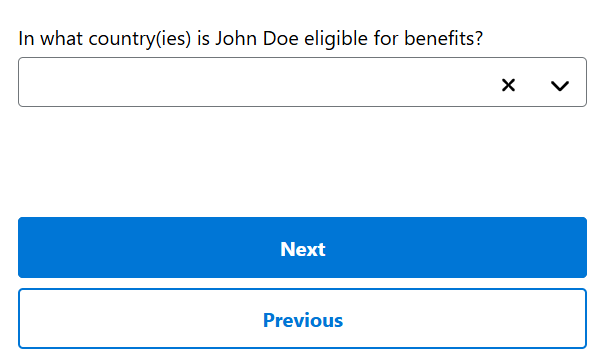
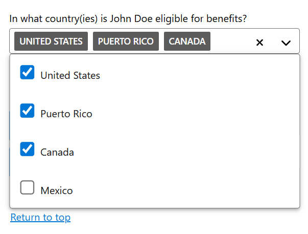
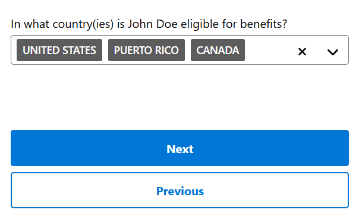

# UEF Pattern-Specific Usability Findings

A review of individual pattern-specific usability test findings conducted by SSA application teams in collaboration with the Design System Team.

## Methodology

The Design System Team (DST) collaborated with User Experience Group (UXG) project teams to conduct individual pattern specific usability testing. The Design System Team provided specific research questions to the UXG project team about the patterns being tested in their prototypes. In return, the UXG project team provided findings specific to the pattern.

## Combobox Findings

Combobox was tested by the Universal Benefits Application (UBA) UXG team on April 30, 2025. The pattern was tested by five UBA users.

Participants were physically located at the Social Security Administration (SSA) UXG Usability Testing Labs. Each participant was provided with an iPhone 14 Plus device to view the prototype. Many participants were squinting their eyes and holding the phone at an angle. The average participant age was 65.

### Findings

* All five participants could not figure out how to close the menu after selecting options in the drop list and expected the menu to automatically close after making their selections.
  * Some participants froze after making selections because they couldn't figure out what to do next or if something was supposed to happen.
* Participants were confused while the menu was open because it covered up the Next button on the page. (*This was an application-specific issue*)
* It was not clear to participants that the menu could be dismissed by selecting outside of the drop list or selecting the arrow icon again.
  * When participants were guided to the arrow icon, they would select it, close the menu, find the Next button, and move on.
* Two participants used the "return to top" link because it was the first link available on the screen after the open droplist, which seemed to close the menu.

