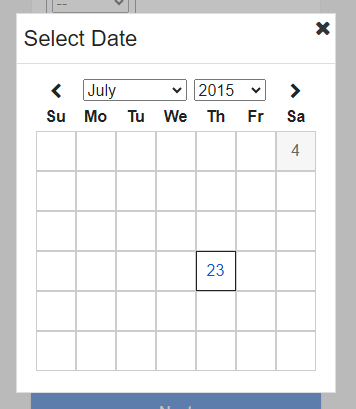
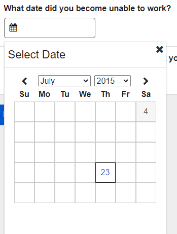
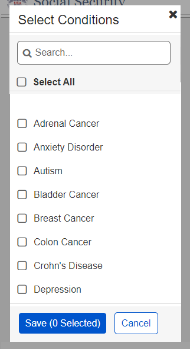
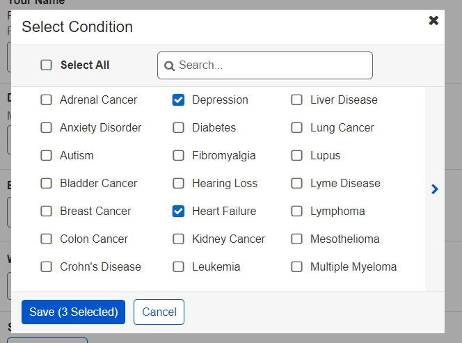
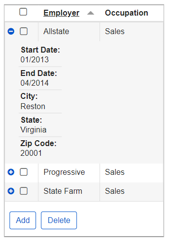
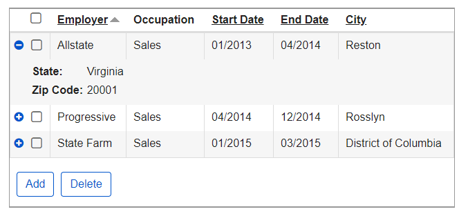

# Round 10 Mobile UEF Pattern Testing Usability Findings

Results overview from Round 10 of the user feedback sessions

## Background

The Mobile UEF team conducted usability testing to evaluate specific UEF patterns in the context of a linear application on mobile and desktop devices. The existing iClaim application was modified to evaluate particular patterns, including:

- Date (Calendar)
- Multi-Select Modal
- Multi-Row Action Table

Testing was conducted on the following types of devices:

- Smartphones
- (iOS and Android) Tablets
- (iOS and Android)

## The Prototype

### Design

The existing iClaim application was modified to incorporate several new patterns. The team chose a linear path application in order to test the new Multi-Row Action Table pattern. There were five screens within the path, two of which incorporated at least one pattern being evaluated. Due to limitations of the Axure prototyping software, the tool was not used to create Multi-Row Action Table pattern.

### Viewport Sizes

As with prior responsive prototypes used in Mobile UEF testing, this prototype was designed with a single breakpoint.
The devices with a viewport size of less than 768 pixels when used in portrait view included: the iPhone 5, Samsung Galaxy S3, Samsung Galaxy S5, Samsung Galaxy Note 4, iPhone 6, and the iPhone 6 Plus.

The devices with a viewport size of 768 and larger included the Samsung Galaxy Note 10.1 and iPad.

The viewport sizes for each mobile device used in this round of testing are as follows:

| Mobile Device  | Viewport Size  | Operating System  |
|---|---|---|
| iPhone 5  | 320 x 568  | iOS  |
| Samsung Galaxy S3  | 360 x 640  | Android  |
| Samsung Galaxy S5  | 360 x 640  | Android  |
|Samsung Galaxy Note 4| 360 x 640| Android|
| iPhone 6  | 375 x 667  | iOS  |
|iPhone 6 Plus| 414 x 736| iOS|
| iPad  | 768 x 1024  | iOS  |
| Samsung Galaxy Note 10.1  | 800 x 1280  | Android  |

## What We Did

With members of the general public, Mobile UEF Team members:

- Conducted user testing with 16 participants on July 23, 2015 at the Community College of Baltimore County (CCBC), Owings Mills location.
  - Sixteen participants tested on one of the following types of devices:
    - Smartphone: 9 total participants
      - 1 using an iPhone 5
      - 2 using an iPhone 6
      - 1 using an iPhone 6 Plus
      - 3 using a Samsung Galaxy S5
      - 2 using a Samsung Galaxy Note 4
    - Tablet: 7 total participants
      - 4 using an iPad
      - 3 using a Samsung Galaxy Note 10.1
    - No desktop users were tested.
- Collected participant information in a pre-test demographic survey, which indicated:
  - Participants ranged in age from 14 to 83, with a median age of 34;
  - All 16 participants owned and used at least one type of mobile device;
  - Two participants had used Social Security’s online services;
  - Eight participants would use a smartphone to access SSA.gov or a MySocialSecurity account.
- Analyzed the results, including:
  - Navigation methods and preferences;
  - Participant issues or comments regarding specific UEF patterns or screen details;
  - User satisfaction scores on the overall experience as indicated in a post-test questionnaire.

## Challenges & Constraints

As with prior Mobile UEF testing sessions, recruiting of volunteer participants was performed on-site during the testing session with outreach to a broad range of library patrons. The usability test scenario and tasks were designed to be completed within 15-20 minutes; prior mobile testing had shown this time range yielded the optimal balance of participants and data in any single day.

## Metrics

Metrics for this usability test were established by the Mobile UEF Workgroup as follows:

- Completion Rate – Percentage of participants who successfully completed the application without assistance
  - Target > 80% for each device type
- Ease of Use – Percentage of participants who indicated the application was “easy” or “very easy” to use, as measured by Questions #3, #5, and #8 of the post-test survey
  - Target > 80% for each device type
- User Satisfaction – Percentage of participants who indicated they were “satisfied” or “very satisfied,” as measured by questions #4 and #7 of the post-test survey
  - Target > 80% for each device type

## What We Learned

Metrics for task completion, ease of use and user satisfaction, as measured by the post-test questionnaire, were as follows:

| Metric  | Target (All)  | Actual Smartphone  | Actual Tablet  |
|---|---|---|---|
| Completion Rate  | 80%  | 96%  | 100%  |
| Ease of Use  | 80%  | 89%  | 72%  |
| User Satisfaction  | 80%  | 100%  | 79%  |

### Post-Test Questionnaire Questions

The following table lists the Post-Test Questionnaire responses by device type as well as overall.

Scale of 1-5, with 1 = lowest and 5=highest Smartphone

| Questions  | Smartphone (n=10)  | Tablet (n=5)  |  Overall (n=15)  |
|---|---|---|---|
| How well did the website match your expectations?  | 4.00 | 4.00 | 4.00 |
| How well did the website support the task you were asked to perform?  | 4.44 | 4.00 | 4.25 |
| How difficult or easy was the website to use?  | 4.33 | 4.29 | 4.31 |
| Are you satisfied with the content?  | 4.56 | 4.00 | 4.31  |
| How difficult or easy was it to move through sections of the website? | 4.00 | 4.43 | 4.19 |
| How easy were the words on the website to understand?  | 4.89 | 4.57 | 4.75 |
| How satisfied are you with the speed at which you can complete tasks?  | 4.11 | 4.57 | 4.31 |
| How difficult or easy was it to find information you needed?  | 4.11 | 4.43 | 4.25 |
| How long would it take you to learn to use this website? | 4.78 | 4.43 | 4.63 |
| How confident did you feel using this application? | 4.56 | 4.71 | 4.63 |
| Average User Satisfaction Score by device type | 4.38 | 4.34 | 4.36 |

### Qualitative Assessment

Usability issues, as well as observations and participant comments, are listed below.

Small Breakpoint: Below 768 pixels (n=9)

Large Breakpoint: 768 pixels and above (n=7)

### UEF PATTERNS

#### **Date (Calendar)**

Small Breakpoint

- There were no major issues with this pattern.
- Clear Date:
- Seven participants removed the date by selecting the X within the field.
- One participant didn’t notice the X and was looking for a way to manually remove the date with the cursor.
  - Date with Black Border:
  - Seven participants understood that the black border represented today’s date.
  - Two participants stated that today’s date should standout more and suggested either a thicker black border or using a different color.
    - One participant stated that the ‘boxes’ (re: the dates on the calendar) were too small.

> Dates shown to participants at the time of testing are not represented in the screenshot below.

Large Breakpoint

- There were no major issues with this pattern.
- Clear Date:
- All seven participants removed the date by selecting the X within the field.
  - Date with Black Border:
  - Three participants understood that the black border represented today’s date.

> Dates shown to participants at the time of testing are not represented in the screenshot below.

#### **Multi-Select Modal**

Small Breakpoint

- There were no major issues with this pattern.
- ‘Save’ Button
- Two participants focused on selecting items within the list and did not notice the ‘Save’ button change. However, they did notice the update once they were ready to select the button.
  - ‘Selected’ Button
  - One participant stated that they would rather see the items listed out on the page after selecting ‘Save.’

Large Breakpoint

- There were no major issues with this pattern.
- ‘Save’ Button
- Two participants focused on selecting items within the list and did not notice the ‘Save’ button change. However, they did notice the update once they were ready to select the button.
  - ‘Selected’ Button
  - One participant stated that they would rather see the items listed out on the page after selecting ‘Save.’
    - One participant didn’t notice the left and right pagination arrows and suggested adding a next button within the footer of the modal.

#### **Multi-Row Action Table**

Small Breakpoint

- Adding a Record:
- There were no issues with adding a record to the table.
- Two participants thought that the plus icon would provide an ‘add’ or ‘edit’ functionality.
  - Expanding a Record:
  - Four participants attempted to open the record by selecting the entire row but when they noticed it didn’t do anything, they used the plus icon.
  - One participant attempted to expand the record by swiping across it.
  - One participant expected the row to highlight when they expanded the record.
    - Deleting a Record:
    - There were no major issues with deleting a record.
    - One participant suggested only showing the action buttons after making a selection.
      - Adding a Record:
      - There were no issues with adding a record to the table.
      - Four participants thought that the plus icon would provide an ‘add’ or ‘edit’ functionality.
        - Expanding a Record:
        - One participant attempted to open the record by selecting the entire row but when they noticed it didn’t do anything, they used the plus icon.
        - One participant attempted to expand the record by swiping across it.
        - One participant attempted to expand the record by doing a long press.
          - Deleting a Record:
          - There were no major issues with deleting a record.

Large Breakpoint

- Adding a Record:
  - There were no issues with adding a record to the table.
  - Four participants thought that the plus icon would provide an ‘add’ or ‘edit’ functionality.
- Expanding a Record:
  - One participant attempted to open the record by selecting the entire row but when they noticed it didn’t do anything, they used the plus icon.
  - One participant attempted to expand the record by swiping across it.
  - One participant attempted to expand the record by doing a long press.
- Deleting a Record:
  - There were no major issues with deleting a record.

#### **Other Findings**

Small Breakpoint

- One participant suggested using state abbreviations in the State drop down list.
  - Two participants suggested using row dividers or highlighting every other row on the Summary page to make the information stand out more.

Large Breakpoint

- Two participants suggested using row dividers or highlighting every other row on the Summary page to make the information stand out more.

## Recommendations and Next Steps

Based on this round of testing, the following patterns were found to be problematic for enough participants to necessitate retesting or design refinements:

- Date (Calendar)
- Multi-Select Modal
- Multi-Row Action Table

Pattern recommendations based on the findings are below.

| Pattern  | Recommendation  |  Rationale  |
|---|---|---|
|Date (Calendar)|Increase current date border to 2px.|Participants felt that the current date border blended in too much with the date grid.|
|Multi-Select Modal|For UEF 2.x, consider revising design to include a better mental model of the selected items.|Participants expected to see items listed out after selecting the Save button.|
|Multi-Row Action Table|For UEF 2.x, consider including a notification that states before using an action button, a record must be selected.|Some participants selected delete before making a selection in the table.|
|Multi-Row Action Table|For UEF 2.x, consider revising the icon for expanding and collapsing a record.|Participants expected the plus icon to provide add or edit functionality to the corresponding record.|
