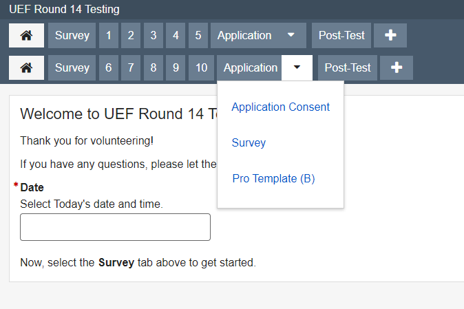
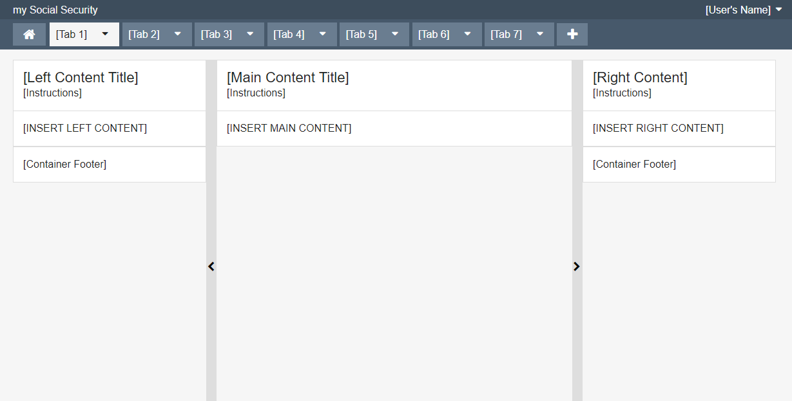
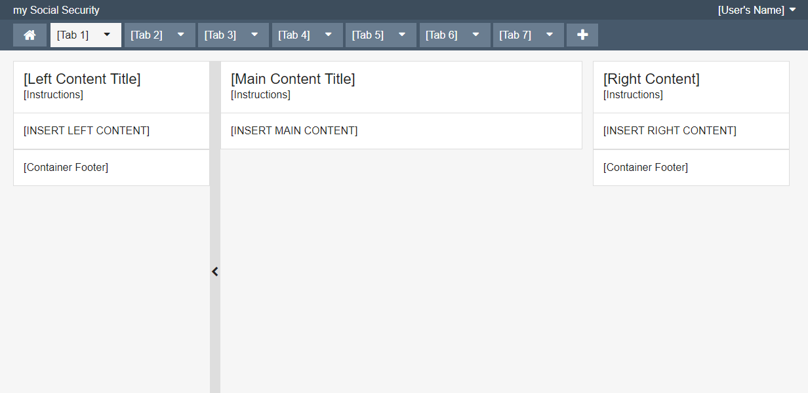
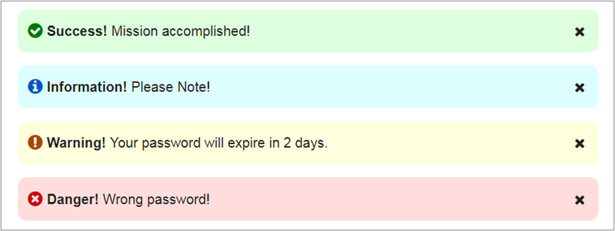
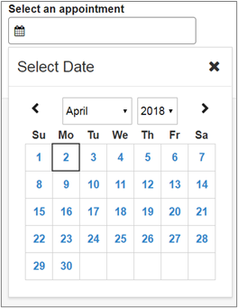
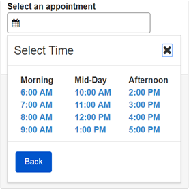
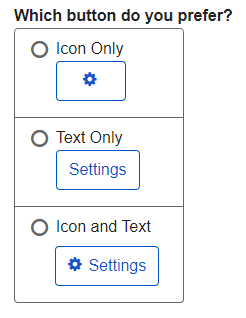

# Round 14 UEF Pattern Testing Usability Findings

Results overview from Round 14 of the user feedback sessions

## Background

The UEF team conducted usability testing to evaluate specific UEF patterns in the context of a non-linear Pro Template application prototype on desktop devices.

The following patterns were evaluated in Round 14 Testing:

- Pro Template Tab with Drop List
- Pro Template ‘+’ Tab
- Pro Template Collapsible Side Panels
- Table Search
- Table Column Selector
- Table Column Reordering
- Input Table
- Horizontal Radio List
- Horizontal Check List
- Dismissible Compact Notice
- Date & Time
- Button with Icon Only

Of particular focus for this round of testing was the UEF Pro Page Template, which is used by internal SSA applications—thus the decision to test in the SSA Cafeteria.

Testing was conducted on laptops.

## The Prototype

## Design

The prototype was designed to test ten UEF patterns in isolation, as well as the UEF Pro Page Template. The overall prototype was segmented into an A/B test, so that each participant would only be presented with half of the individual test scenarios. This allowed us to minimize test time. Additionally, the prototype was integrated with three data analytics features:

1. Embedded Single Ease Question (SEQ) forms for each UEF pattern
2. Kantu (Selenium) Web Automation extension for the Chrome browser
3. Google Analytics (with the UX-centric AutoTrack plugin)

This allowed the facilitators to spend more time observing the tests, while the automated analytics tools gathered user input and recorded interactions.

## What We Did

With members of the SSA community, UEF Team members:

- Conducted user testing with 20 participants on April 17, 2017 at the SSA Cafeteria from 11am-1pm.
- All participants were tested on laptops.
- Analyzed the results, including:
  - A/B tests
  - Participant issues or comments regarding specific UEF patterns or screen details;
  - Ease of Use scores (SEQ) on each UEF pattern.

## Challenges & Constraints

As with prior UEF testing sessions, recruiting of volunteer participants was performed on-site during the testing session with outreach to a broad range of SSA employees. The usability test scenarios and tasks were designed to be completed within 10 minutes; prior testing had shown this time range yielded the optimal balance of participants and data in any single day.

## Metrics

Metrics for this usability test were established by the UEF Workgroup as follows:

- Completion Rate – Percentage of participants who successfully completed each test without assistance
  - Target > 80%
- Ease of Use – Percentage of participants who indicated the application was “easy” or “very easy” to use, as measured by the SEQ scores for each UEF pattern tested
  - Target > 80% for each device type

<!--
## What We Learned

Metrics for task completion and ease of use (SEQ), were as follows:

| Pattern / Component  | # Participants  | Metric (Completion Rate)  | Metric (Ease of Use)   | Target  | Laptop |
|---|---|---|---|---|---|
| Pro Template Tab with Drop List | 15 | >= 80% | 87% | > 80% | 81% |
-->

## What We Learned

This section discusses the usability issues, as well as observations and participant comments. The patterns tested within this evaluation group the findings.

### **Pro Template Tab with Drop List:**

**Metrics:**

Participants: 15

Completion Rate: 87%

Ease of Use: 81%

**Findings:**

1. 13 of 15 participants successfully discovered and opened the Drop List tab on the Pro Page Template. Two participants failed to discover the tab’s Drop List feature.
2. No issues or difficulty of use/understanding with the Tab Drop List.
Pro Template ‘+’ Tab
3. 12 of 15 participants successfully discovered and correctly identified the purpose of this tab. The remaining three participants discovered the tab, but indicated that the purpose was to add in more information.
Pro Template Collapsible Side Panels
4. The Collapsible Side Panels were presented within an A/B test, with the currently implemented design (hidden panel triggers) represented in one test, and an alternative design (visible panel triggers) in the other test. Both tests failed our success criteria, with only about half of participants able to complete the task, regardless of the two designs.
5. Participants also indicated that this task was difficult to comprehend and execute.
6. Some notable comments from participants included:
  a. “Very unclear onscreen what you need to do.”
  b. “I don’t find the hidden hover grab bars to be generally easy to use.”
  c. “I didn’t like the appearance of the buttons themselves. The buttons were also sort of small.”
7. Facilitators noted that many participants were confused, often right-clicking in the page columns or attempting to drag the column indicators.

### **Pro Template with Tab:**

**Metrics:**

Participants: 15

Completion Rate: 80%

Ease of Use: 81%

**Findings:**

1. 12 of 15 participants successfully discovered and correctly identified the purpose of this tab. The remaining three participants discovered the tab, but indicated that the purpose was to add in more information.

### **Pro Template Collapsible Side Panels (visible trigger):**

**Metrics:**

Participants: 8

Completion Rate: 50%

Ease of Use: 39%

**Findings:**

1. The Collapsible Side Panels were presented within an A/B test, with the currently implemented design (visible panel triggers). The test failed our success criteria, with only about half of participants able to complete the task.
2. Participants also indicated that this task was difficult to comprehend and execute.

**Participant comments:**

General:
> “Very unclear onscreen what you need to do”
> “I didn’t like the appearance of the buttons themselves. The buttons were also sort of small.”

### **Pro Template Collapsible Side Panels (hidden trigger):**

**Metrics:**

Participants: 10

Completion Rate: 60%

Ease of Use: 39%

**Findings:**

1. The Collapsible Side Panels were presented within an A/B test, with the currently implemented design (hidden panel triggers) represented in one test, and an alternative design (visible panel triggers) in the other test. Both tests failed our success criteria, with only about half of participants able to complete the task, regardless of the two designs.
2. Facilitators noted that many participants were confused, often right-clicking in the page columns or attempting to drag the column indicators.

**Participant comments:**

General:
> “I don’t find the hidden hover grab bars to be generally easy to use.”

### **Table Search**

**Metrics:**

Participants: 9

Completion Rate: 22%

Ease of Use: 57%

1. Only 2 of 9 participants were able to successfully complete this task, making it the worst performing task of the test session.
2. The majority of the participants attempted to click in the area to the left of the search icon.

### **Table Column Selector**

**Metrics:**

Participants: 9

Completion Rate: 56%

Ease of Use: 60%

1. A little more than half (5 of 9) of the participants were able to complete this task successfully.
2. Facilitators noted that within the group of participants who succeeded with this task, several exhibited hesitation, stating that “I didn’t know what that icon meant”.
3. The participants who failed this task, did so with the following actions:
  a. One participant tried to right-click in the area to the left of the column selector icon.
  b. Three participants did not discover the column selector icon.

#### **Table Column Reordering**

**Metrics:**

Participants: 9

Completion Rate: 44%

Ease of Use: 57%

1. A little less than half (4 of 9) participants were able to complete this task successfully.
2. For one of the participants that succeeded, he acknowledged that “he got lucky and guessed”.
3. Of the 5 participants that failed this task, they did so with the following actions:
  a. One participant right-clicked on the table column headers.
  b. For the remaining four participants, they were not able to discover the ability to drag the table column headers.

#### **Input Table**

**Metrics:**

Participants: 8

Completion Rate: 100%

Ease of Use: 81%

1. All 8 participants were able to successfully complete the task of entering info directly into a table.
2. Almost all participants used the Tab key to move between input fields within the table.
3. One participant noted that “I would prefer having my input item above the table instead of mixed into the data.”
4. There were no issues or difficulty in entering info directly within the table.

#### **Horizontal Radio List**

**Metrics:**

Participants: 9

Completion Rate: 100%

Ease of Use: 80%

1. Nine participants were presented with a page containing three horizontal radio lists:
  a. A Radio List with 5 entries of fairly lengthy text.
  b. A Radio List with 5 entries of short text.
  c. A Yes/No/Other radio list with ‘Prefer Not to Answer’ as the ‘Other’ item.
2. All 9 participants were able to successfully complete this task, with the following comments:
  a. “I like the answers displayed up/down instead of across.”
  b. “I personally think the screen would be more readable if the choice lists were vertical and not horizontal.”
3. Facilitators noted that the Radio List with the lengthy text slowed the participants down.

#### **Horizontal Check List**

**Metrics:**

Participants: 12

Completion Rate: 100%

Ease of Use: 86%

1. Twelve participants were presented with a page containing a check list of items with short text.
2. All 12 participants were able to complete the task successfully.
3. The facilitators noted that most participants indicated that they would prefer to select items vertically.

#### **Dismissible Compact Notice**

**Metrics:**

Participants: 11

Completion Rate: 82%

Ease of Use: 84%

1. Nine of 11 participants were able to successfully close (dismiss) the compact notices on this page.
2. Two participants did not select the ‘X’ icons to close the notices.

#### **Date & Time**

**Metrics:**

Participants: 17

Completion Rate: 100%

Ease of Use: 93%

1. All 17 participants (100%) were able to successfully complete the task of specifying both a date and time.
2. One participant mentioned that a “Today” option would have been nice.
3. One participant expected to see both the calendar and time options visible at the same time.
4. One participant mentioned “Did not expect to see time set up that way but it was nice.”
5. Even though most participants didn’t expect to see the time interface appear after selecting a date, all knew what to do.

#### **Button with Icon Only**

**Metrics:**

Participants: 13

Completion Rate: 38%

Ease of Use: N/A

1. Only 5 of 13 participants were able to successfully indicate what the purpose of the button was (Settings or User Settings), using only an icon.
2. Of the 8 participants who failed to successfully indicate the purpose of the button, comments were varied:
  a. “Takes me back to the previous page.”
  b. “Popup with instructions, maybe?”
  c. “My guess would be it expands a menu.”
3. All participants indicated that they would prefer a button with both an icon and a text label.

#### **Button with Icon and Text**

**Metrics:**

Participants: 11

Completion Rate: 100%

Ease of Use: 99%

## Recommendations and Next Steps

Based on this round of testing, the following patterns were found to be problematic for enough participants to necessitate retesting or design refinements:

- Pro Page Template Collapsible Side Panels
- Table Search
- Table Column Selector
- Table Column Reordering
- Button with Icon Only

Pattern recommendations based on the findings are below.

| Pattern  | Recommendation  |  Rationale  |
|---|---|---|
|Pro Template Tab with Drop List|Consider redesign of tabs to make them easier to find.|Some participants had trouble using the global navigation including the drop button.|
|Pro Template ‘+’ Tab|Keep design as tested but retest showing the intended functionality.|There were no issues with this pattern.|
|Pro Template Collapsible Side Panels|Consider redesigning feature and re-prioritize. |Most participants could not locate the feature. If they did, they did not know how to use it.|
|Table Search|Consider redesign to make it easier to understand and locate. |Most users clicked to the left of the icon thinking it was the search area.|
|Table Column Selector|Consider update to icon or change to text. |Most users did know what the icon meant or how it functioned.|
|Table Column Reordering|Consider redesign to make the feature stand out to users. |Most users did not locate the feature within the table.|
|Input Table|Keep design as tested.| There were no issues with this pattern.|
|Horizontal Radio List|Keep design as tested.| There were no issues with this pattern.|
Horizontal Check List|Keep design as tested.| There were no issues with this pattern.|
|Dismissible Compact Notice|Keep design as tested. |There were no issues with this pattern.|
|Date & Time|Consider addressing the expectation issue. |Many participants did not expect to see the time modal appear. However, they were still able to complete the task.|
|Button with Icon Only|Always use a Button with a text label. |Confirms existing UX research in this area.|
