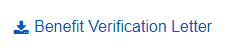
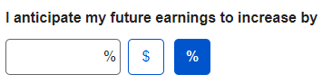

# Round 16 UEF Pattern Testing Usability Findings

Results overview from Round 16 of the user feedback sessions

## Background

The UEF team conducted usability testing to evaluate specific UEF patterns in the context of a non-linear Public Template application prototype on desktop and mobile devices.

The following patterns were evaluated in Round 16 Testing:

- Password (Show/Hide)
- Download Link
- Amount/Percent Toggle
- Template (More Menu)
- SSN (Show/Hide)
- Drop Down Button (Split)
- Radio List (Series)
- Back to Top

## Methodology

The UXG UEF team conducted usability testing with twelve participants on February 27, 2019. The evaluations took place at the Baltimore County Public Library (BCPL) Owings Mills Branch. Evaluations were conducted on tablet and mobile devices.

During each evaluation, participants walked through a series of scenarios that allowed them to look at each of the patterns being tested. The prototype design was a fictitious external application to update a mySSA application.

## Participant Information

Twelve participants were involved in the evaluations. Their demographic information was as follows:

- Participants were between the ages of 17 and 79 with an average age of 42
- Four out of twelve participants have a degree of higher education (4-year or graduate)
  - Three participants have a grad degree
  - One participant has a 4-year degree
  - Five participants have some college
- Seven out of twelve participants access the internet on a Desktop, Tablet and Smartphone
- Two out of twelve participants have a mySocialSecurity account online
- Four  out of twelve participants use a mobile device for emails, browsing, news, social media and banking
- Eight out twelve participants would use a desktop or laptop to access SSA.gov
  - Two participants would use a tablet
  - One participant would use a smartphone

## Lessons Learned

The UXG team discussed lessons learned from this round of testing. Those included the following:

- The team experience very slow traffic at the BCPL Owings Mills Branch
- This day of the week chosen, Wednesday, was a low traffic day. Tuesday and Thursday would have been a better day because of activities going on at the library.
- The temperature was very cold by the open/closed doors
- Traffic picked up in the afternoon, we got all 12 participants by 2 pm

## Metrics

Metrics for this usability test were established by the UEF Workgroup as follows. Each has a target of 80%.

- Completion Rate – Percentage of participants who successfully completed the application without assistance
- Ease of Use – Percentage of participants who indicated the application was “easy” or “very easy” to use, as measured by Questions #3, #5, and #8 of the post-test survey
- User Satisfaction – Percentage of participants who indicated they were “satisfied” or “very satisfied,” as measured by questions #4 and #7 of the post-test survey

## What We Learned

Metrics for task completion, ease of use and user satisfaction, as measured by the post-test questionnaire, were as follows:

| Metric  | Target  | Actual  |
|---|---|---|
|Completion Rate|>=80%|100%|
|Ease of Use|>=80%|84%|
|User Satisfaction|>=80%|81%|

### Post-Test Questionnaire

The following table lists the Post-Test Questionnaire responses.
Scale of 1-5, with 1 = lowest and 5=highest Overall

| Questions  | n=12|
|---|---|
|1. How well did the website match your expectations?|4.5|
|2. How well did the website support the task you were asked to perform?|4.4|
|3. How difficult or easy was the website to use?|4.4|
|4. Are you satisfied with the content?|4.3|
|5. How difficult or easy was it to move through sections of the website?|4.5|
|6. How easy were the words on the website to understand?|4.7|
|7. How satisfied are you with the speed at which you can complete tasks?|4.5|
|8. How difficult or easy was it to find information you needed?|4.5|
|9. How long would it take you to learn to use this website?|4|
|10. How confident did you feel using this application?|4.2|
|11. **Average User Satisfaction Score**|4.4|

### Qualitative Assessment

This section discusses the usability issues, as well as observations and participant comments. The patterns tested within this evaluation group the findings.

#### **Password – Show/Hide**

1. Nine out of twelve participants had no issues with this pattern.
2. One participant thought the icon looked like the CBS icon.
3. One participant thought that if the password entered was correctly they would see a check mark.
4. Majority were ok with clicking on something to show and hide the password whether or not it was a text or icon.

**Participant comments:**

> “Words would be more helpful, rather than an icon.”
>
> “Nice to have.”
>
> “You should use biometrics (fingerprints) instead of password.”

#### **Download Link**

1. Majority of participants had no issues with this pattern.
2. One participant thought that if you click on the link it would open a new tab.
3. One participant did not understand that it was a download link, they thought they icon meant to go down.

**Participant comments:**

> “Where is this being downloaded to on my phone?”

#### **Amount/Percent Toggle**

1. Nine out of twelve participants had no issues with this pattern.
2. One participant failed because they did not know where to find the testing scenario in the application. The amount/percent toggle was below the fold.

**Participant comments:**

> “Make the percent sign bolder”
>
> “Adding instruction text dollar/percent would make it easier to understand.”

#### **Template (More Menu)**

1. This pattern was only applicable to desktop and tablet participants.
2. Three out of three participants had no issues with this pattern.

#### **SSN (Show/Hide)**

1. Ten out of twelve participants had no issues with this pattern.
2. Three out of twelve participants said they expected the phone number pattern to have the same formatting as the SSN (Show/Hide).
3. Three out of twelve participants said they liked the eye icon over the SHOW text.
4. One participant expected to see an underline as a placeholder for each number.
5. One participant wanted to see the dashes before they entered any numbers into the field.
6. Participants were confused to see the mobile keyboard switch to letters after typing in the first number. (In development, the keypad should always be numerical.)

#### **Drop Down Button (Split)**

1. Ten out of twelve participants had no issues with this pattern.
2. Two out of twelve participants did not know that both sides of the button were clickable.
3. One participant mentioned that the arrow icon on the button was a good indicator that there were more options.

#### **Radio List (Series)**

1. Nine out of twelve participants had no issues with this pattern.
2. The amount of radio lists on the page confused some participants.
3. Participants did not like the fact that they had to scroll so much to get to the bottom of the page.

**Participant comments:**

> “This page is really long!”

#### **Back to Top**

1. Seven out of twelve participants had no issues with this pattern.
2. Most users on mobile did not see the need to use the back to top.
3. One participant said that a different color would make the pattern stand out more.

## Recommendations and Next Steps

Based on this round of testing, the following patterns were found to be problematic for enough participants to necessitate retesting or design refinements:

- Password (Show/Hide)
- Download Link
- Amount/Percent Toggle
- Radio List (Series)
- Back to Top (New Design)

Pattern recommendations based on the findings are below.

| Pattern  | Recommendation  |  Rationale  |
|---|---|---|
|Password (Show/Hide)|Re-test with text instead of icon only.|Some Participants had issues understanding the icon.|
|Download Link|Re-test with different icon.|All participants completed the task for this test; however, some participants did not understand the icon.|
|Amount/Percent Toggle|1. Re-test with different font weight or color. 2. Add instruction text.|Participants had issues discovering the percent button.|
|Template (More Menu)|Continue with the current design.|There were no major issues with this pattern.|
|SSN(Show/Hide)|Continue with the current design.|There were no major issues with this pattern.|
|Drop Down Button (Split)|Continue with the current design.|There were no major issues with this pattern.|
|Radio List (Series)|Keep design as tested, but re-test with a shorter scenario.|Participants were confused with the number of radio lists on the page.|
|Back to Top|Retest with different color.|Several participants needed prompting to use the pattern. Participants understood what the pattern was but did not feel the need to use it on mobile.|
