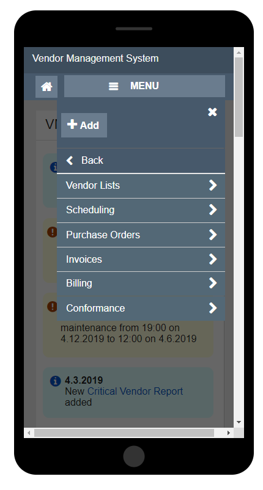
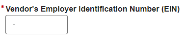

# Round 17 UEF Pattern Testing Usability Findings

Results overview from Round 17 of the user feedback sessions

## Background

The User Experience Framework (UEF) team conducted usability testing to evaluate specific UEF patterns in the context of a non-linear Pro Template application prototype on desktop devices.
The following patterns were evaluated in Round 17 Testing:

- PRO Template Responsive Tabs
- PRO Template Mega Menu Tab
- PRO Template Collapsible Panels
- Mobile Mega Menu
- Input Table with Errors
- Input Table Inline Editing
- Table Column Selector
- Back to Top (A/B grey and orange colors)
- Radio List Series
- Text Area (Rich Text)
- Phone (US) (new formatting)
- EIN (new formatting)

## Methodology

The User Experience Group (UXG) UEF team conducted usability testing with six participants on June 18-19, 2019. The evaluations took place in the UXG labs at SSA. All evaluations were conducted on desktop computers.

Rapid Iterative Testing Evaluation (RITE) was the method of choice during round 17. The team conducted three rounds of evaluations with two participants at a time (six total participants). After each round, the facilitators and the UXG UEF team met for a half hour debrief. During each debrief the team discussed the issues found and potential changes to the patterns that would be shown to the next set of participants.

During each evaluation, participants walked through a series of scenarios that allowed them to look at each of the patterns being tested. The prototype design was a fictitious internal application to review a vendor management system. In order for the prototype to be iterative, it was built with HTML and CSS using the UXG Genesys Design Tool.

After the evaluations were complete, the team analyzed the results including:

- Facilitator Guide metrics on ease of use;
- Participant issues or comments regarding specific UEF patterns or screen details;
- User satisfaction scores on the overall experience as indicated in the post-test questionnaire.

## Participant Information

Six participants were involved in the evaluations. Their demographic information was as follows:

- Participants were between the ages of 37 and 60 with an average age of 47
- Five out of six participants have a degree of higher education (4-year or graduate)
  - Three participants have a grad degree
  - Two participants have a 4-year degree
  - One participant has some college
- All participants access the internet on a Desktop, Tablet and Smartphone
- Two participants have a mySocialSecurity account online banking
- Three participants would use a desktop or laptop to access SSA.gov
  - Two participants would use a smartphone

## Lessons Learned

The UXG team discussed lessons learned from this round of testing. Those included the following:

- Request time out extension from TDOT to prevent lockout screen from interrupting testing session on observer side.
- Conduct a dry run with adequate time to allow updates to the guide or prototype if needed before testing.
- Rite methodology worked well again.
- When recruiting, have facilitators send an email directly to Amy and she will sign them up. If someone is on our "no fly list", tell them politely that we have no spots available.

## Metrics

Metrics for this usability test were established by the UEF Workgroup as follows. Each has a target of 80%.

- Completion Rate – Percentage of participants who successfully completed the application without assistance
- Ease of Use – Percentage of participants who indicated the application was “easy” or “very easy” to use, as measured by Questions #3, #5, and #8 of the post-test survey
- User Satisfaction – Percentage of participants who indicated they were “satisfied” or “very satisfied,” as measured by questions #4 and #7 of the post-test survey

## What We Learned

Metrics for task completion, ease of use and user satisfaction, as measured by the post-test questionnaire, were as follows:

| Metric  | Target  | Actual  |
|---|---|---|
|Completion Rate|>=80%|100%|
|Ease of Use|>=80%|84%|
|User Satisfaction|>=80%|81%|

### Post-Test Questionnaire

The following table lists the Post-Test Questionnaire responses.
Scale of 1-5, with 1 = lowest and 5=highest Overall

| Questions  | n=6|
|---|---|
|1. How well did the website match your expectations?|3.8|
|2. How well did the website support the task you were asked to perform?|4.6|
|3. How difficult or easy was the website to use?|4.6|
|4. Are you satisfied with the content?|4.3|
|5. How difficult or easy was it to move through sections of the website?|4.5|
|6. How easy were the words on the website to understand?|4.8|
|7. How satisfied are you with the speed at which you can complete tasks?|4.3|
|8. How difficult or easy was it to find information you needed?|4.3|
|9. How long would it take you to learn to use this website?|4.3|
|10. How confident did you feel using this application?|4.6|
|11. **Average User Satisfaction Score**|**4.4**|

### Qualitative Assessment

This section discusses the usability issues, as well as observations and participant comments. The patterns tested within this evaluation group the findings.

#### **PRO Template Responsive Tabs**

1. Five out of six participants had no issues.
2. Participants commented that they liked the consistency between mobile and desktop versions.
3. Participant did not even notice the tab to access the mega menu.

#### **PRO Template Desktop Mega Menu Tab**

1. Three out of six participants had no issues.
2. All six participants had issues locating the menu but had no issues once they found it. *Some issues were context-related.*
3. Two participants thought the design was busy and wanted to see all the columns in one row.
4. Two participants expected the headers to be aligned.
5. One participant stated that they liked the consistency of the mobile and desktop designs.

#### **PRO Template Collapsible Panels**

1. Four out of six participants had no issues.
2. One participant stated that the panel controls were "pretty visible, standard, and more prominent than systems used before."
3. One participant had difficulty because they were looking for an X icon to collapse the panel.
4. One participant had difficulty locating the panel controls.
5. One participant stated that the interaction was fast and clean.

#### **Input Table with Errors**

1. Five out of six participants had no issues.
2. Two participants did not notice the error instruction text above the table.
3. One participant was worried that when the table is really long the error instruction text may not be noticed.

#### **Table (Column Selector)**

1. Five out of six participants had no issues completing the task.
2. One participant expected to drag a column out of the table to remove. They stated that the button didn't make sense and suggested using the word "Customize".
3. Two participants clicked outside the menu to dismiss.
4. One participant wanted a reset view option.
5. One participant did not complete the task due to time constraints.

#### **Back to Top (A/B Gray and Orange Colors)**

1. Two out of six participants had no issues
2. Most participants did not use Back to Top because they preferred to scroll.
3. Two participants did not notice it but understood the purpose.

**Color Preference:** Four out of six participants preferred the orange color. One participant did mention that the orange color was attention grabbing but would be annoying after a while and therefore would prefer the gray color.

#### **Radio List Series**

1. All six participants had no issues.
2. Participants liked that they could tab through to make selections.

#### **Text Area (Rich Text)**

1. All six participants had no issues completing the task.
2. Three participants wanted to use keyboard shortcuts (e.g. CTRL+U, CTRL+C, CTRL+V, etc.)
3. Three participants wanted advanced features such as importing text, insert images, and attach a file.

#### **Phone Number (US) (New Formatting)**

6/6 Participants had no issues with this pattern

1. No major issues with this pattern.
2. Participants liked the formatting.

#### **Employer Identification Number (EIN) (New Formatting)**

6/6 Participants had no issues with this pattern

1. No major issues with this pattern.
2. Participants liked the predictable formatting.

## Recommendations and Next Steps

Based on this round of testing, the following patterns were found to be problematic for enough participants to necessitate retesting or design refinements:

- Password (Enter)
- Text Area (Rich Text)
- Drop Down Button (Split)
- Table (Column Selector)
- Back to Top (New Design)
- PRO Template Collapsible Panels
- PRO Template Drop Down Tab

Pattern recommendations based on the findings are below.

| Pattern  | Recommendation  |  Rationale  |
|---|---|---|
|Pro Template Responsive Tabs||No issues.|
|Pro Template Mega menu Tab|1. Align the headers.  2. Demonstrate worst case scenario with white space.|Some participants expected the headers in the menu be aligned for better readability.|
|PRO Template Collapsible Panels|1. Re-test with updated design.  2. Add double arrows and UEF Tooltip|Participants had issues discovering the show hide panels.|
|Mobile Mega Menu|Update Menu button color.|Participants had issues locating the button because it blended in with the background.|
|Input Table with Errors|Continue with the current design.|There were no major issues with this pattern.|
|Table Column Selector|Re-test with updated column selector icon.|Some participants did not understand the meaning of the current icon.|
|Back to Top (A/B grey and orange colors)|1. Use the orange design.  2. Make visible by default  3. Place on all pages by default  4. Allow applications to disable  5. Allow applications to decide if they want Back to Top on all pages or a single page|Participants preferred the orange color.|
|Radio List Series|Continue with current design.|No Issues|
|Text Area (Rich Text)|Provide the ability to use keyboard shortcuts.|Several participants wanted to use advanced features such as keyboard shortcuts.|
|Phone (US) (New Formatting)|Continue with current design.|No Issues|
|EIN (New Formatting)|Continue with current design.|No Issues|
