# Round 18 UEF Pattern Testing Usability Findings

Results overview from Round 18 of the user feedback sessions

## Background

The UEF team conducted usability testing to evaluate specific UEF patterns in the context of a non-linear Pro Template application prototype on desktop devices.

The following patterns were evaluated in Round 18 Testing:

- PRO Template Responsive Navigation
- PRO Template Drop Down (Mega Menu) Tab
- PRO Template Collapsible Panels
- Date and Time
- Mega-Select (Radio)
- Advanced Table Filtering
- Table (Column Selector)
- Summary(Show/Hide)

## Methodology

The UXG UEF team conducted usability testing with six participants on October 15-16, 2019. The evaluations took place in the UXG labs at SSA. All evaluations were conducted on desktop computers.

Rapid Iterative Testing Evaluation (RITE) was the method of choice during round 18. The team conducted three rounds of evaluations with two participants at a time (six total participants). After each round, the facilitators and the UXG UEF team met for a half hour debrief. During each debrief the team discussed the issues found and potential changes to the patterns that would be shown to the next set of participants.

During each evaluation, participants walked through a series of scenarios that allowed them to look at each of the patterns being tested. The prototype design was a fictitious internal vendor management system. The prototype was built with HTML and Axure.

## Participant Information

Six participants were involved in the evaluations. Their demographic information was as follows:

- Participants were between the ages of 22 and 70 with an average age of 50
- One out of six participants had a degree of higher education (4-year or graduate)
  - One participant had a 4-year degree
  - Two participants had a 2-year degree
  - 3 participants had some college
- Four out of six participants access the internet on a Desktop, Tablet and Smartphone
  - Six out of six participants access the internet on a Desktop
- Three out of six participants have a mySocialSecurity account online
- Five out of six participants use a mobile device for emails, browsing, news, social media and banking
- Four out of six participants would use a desktop or laptop to access SSA.gov
  - Two participants would use a tablet
  - One participant would not access SSA.gov

## Lessons Learned

The UXG team discussed lessons learned from this round of testing. Those included the following:

- The team liked the testing methodology used
- The team had no issues making updates to the Axure and HTML prototype
- Remember to clear cache after updates to the prototype
- Allow for more time to debrief the facilitators on any updates that were made to the prototype

## Metrics

Metrics for this usability test were established by the UEF Workgroup as follows. Each has a target of 80%.

- Completion Rate – Percentage of participants who successfully completed the application without assistance
- Ease of Use – Percentage of participants who indicated the application was “easy” or “very easy” to use, as measured by Questions #3, #5, and #8 of the post-test survey
- User Satisfaction – Percentage of participants who indicated they were “satisfied” or “very satisfied,” as measured by questions #4 and #7 of the post-test survey

## What We Learned

Metrics for task completion, ease of use and user satisfaction, as measured by the post-test questionnaire, were as follows:

| Metric  | Target  | Actual  |
|---|---|---|
|Completion Rate|>=80%|100%|
|Ease of Use|>=80%|84%|
|User Satisfaction|>=80%|81%|

The following table lists the Post-Test Questionnaire responses.

*Questions 9 and 10 were omitted because they were left out of the guide for most participants.
Participant 6 did not complete any of the questions.

### **Scale of 1-5, with 1 = lowest and 5=highest Overall**

| Post-Test Questionnaire Questions  | n=5  |
|---|---|
|1. How well did the website match your expectations?|3.4|
|2. How well did the website support the task you were asked to perform?|3.8|
|3. How difficult or easy was the website to use?|3.8|
|4. Are you satisfied with the content?|3.4|
|5. How difficult or easy was it to move through sections of the website?|3.4|
|6. How easy were the words on the website to understand?|3.2|
|7. How satisfied are you with the speed at which you can complete tasks?|3.6|
|8. How difficult or easy was it to find information you needed?|4|
|9. **Average User Satisfaction Score**|3.6|

### Qualitative Assessment

This section discusses the usability issues, as well as observations and participant comments. The patterns tested within this evaluation group the findings.

#### **Pro Template Collapsible Panels**

1. Four out of six participants had no issues.
2. Two participants expected to use an X icon to close the panels.
3. One participant mentioned that the tooltip was very helpful.

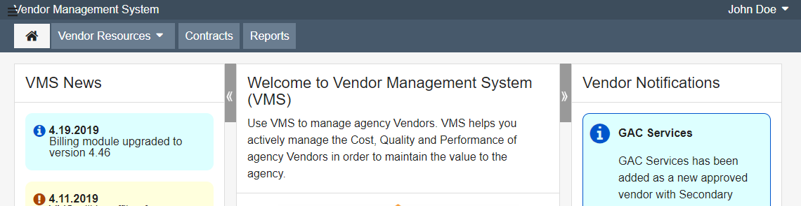

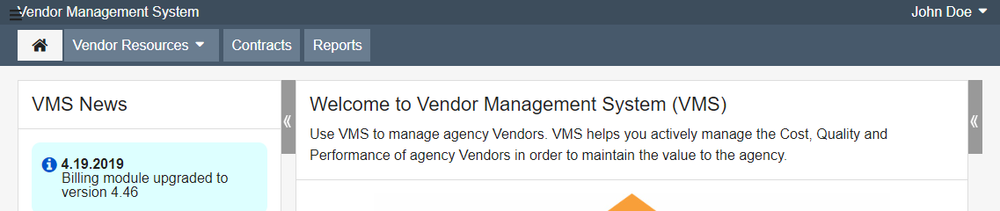

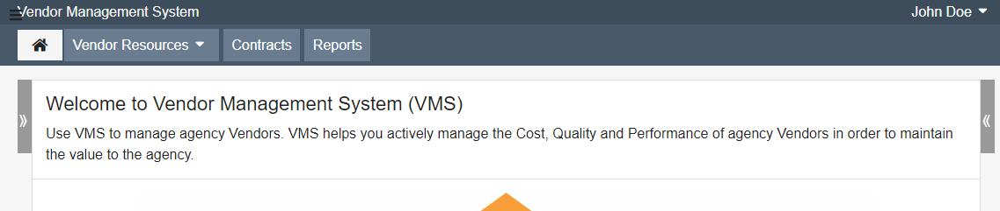

#### **Pro Template Drop Down (Mega Menu) Tab**

1. Three out of six participants had no issues.
2. Participants had difficulty locating the menu (*Context issue for prototype. Not an issue with the pattern*)
3. One participant thought the split functionality of the tab was confusing.
4. One participant felt that the colors blended too much and wanted to see bigger headers.

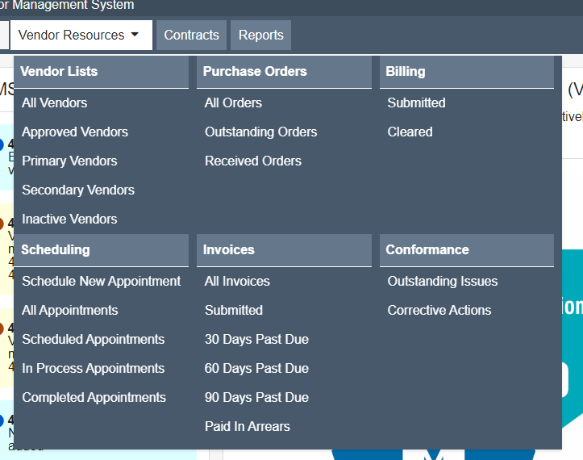

#### **Advanced Table Filtering**

1. Three out of six participants had no issues
2. Two participant expected to find the filter within "Settings".
3. One participant did not like the funnel icon.
4. One participant stated that they liked the funnel icon.

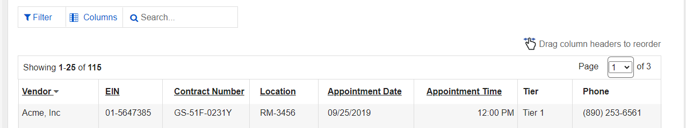

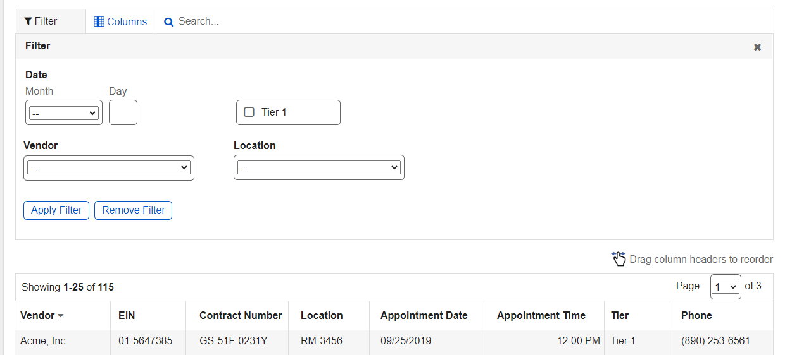

#### **Table Column Selector**

1. There were no major issues with this pattern.
2. One participant stated this was a nice feature and liked the icon.
3. One participant expected an instruction tooltip.

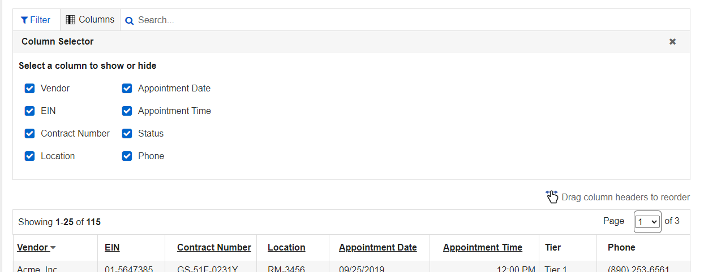

#### **Date and Time**

1. There were no major issues with this pattern.
2. One participant did not expect date and time to be combined.
3. One participant suggested moving the save button up to the right.

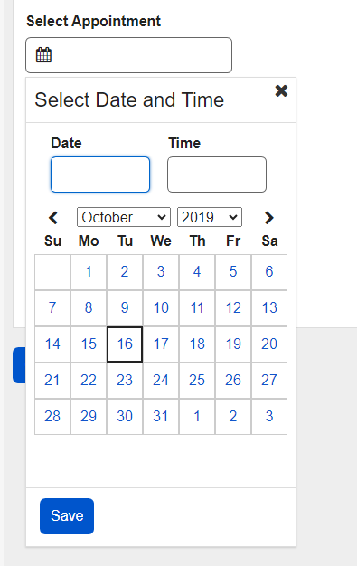

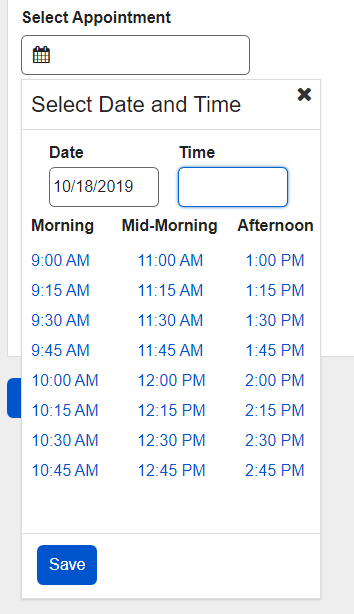

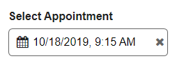

#### **Mega-Select Radio**

1. There were no major issues with this pattern.
2. Two participants preferred to scroll rather than paginate through the options.
3. One participant stated that they liked the search functionality.

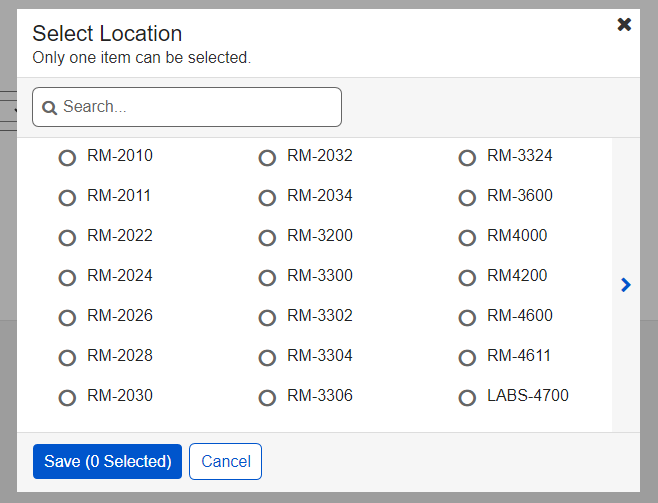

#### **Summary (Show/Hide)**

1. There were no major issues with this pattern.
2. Four participants stated that they would have preferred to see the information expanded by default.

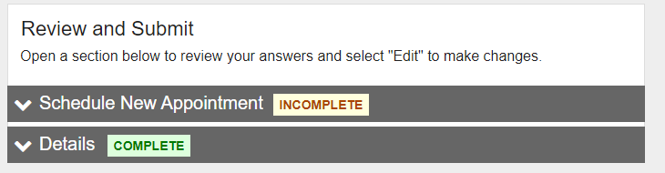

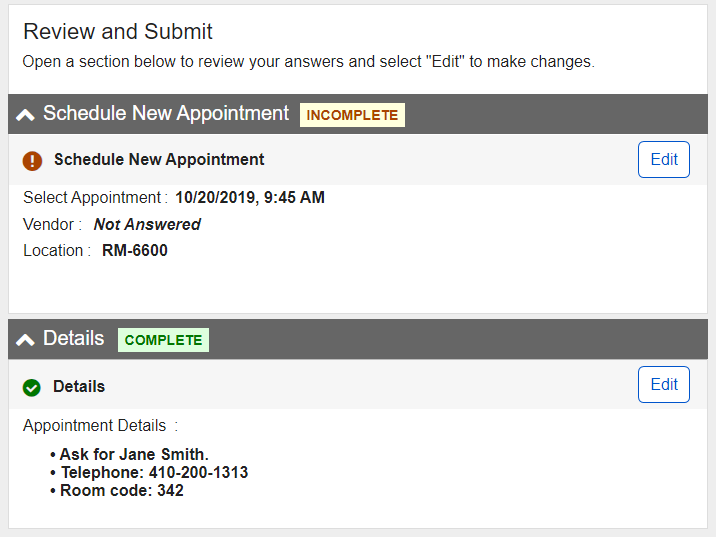

#### **Mega Menu (Mobile)**

1. Five out of six participants had no issues.
2. One participant scrolled down before selecting the Menu.
3. One participant thought there were too many clicks to navigate to the page in the task.

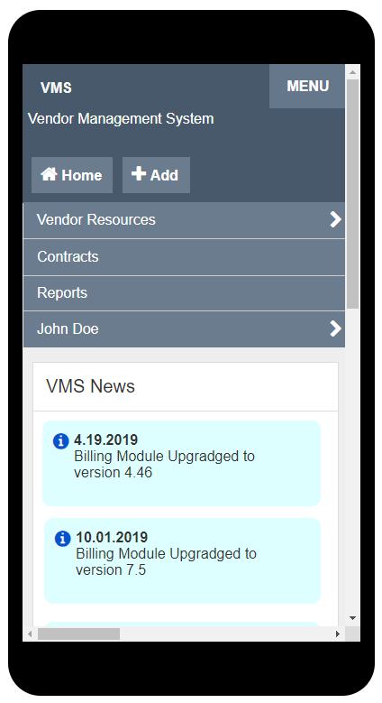

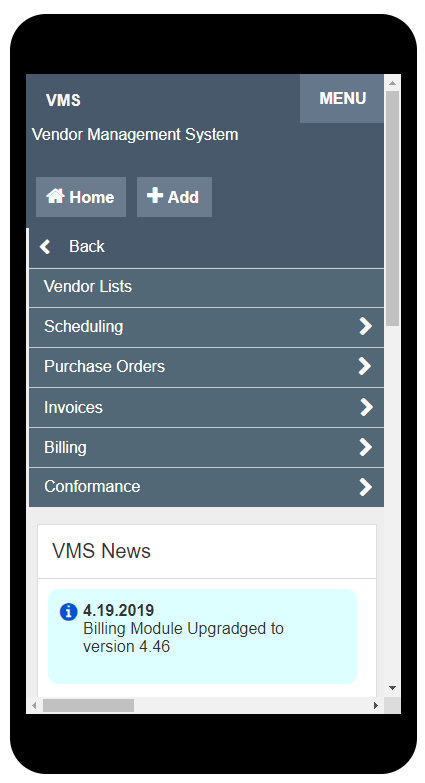

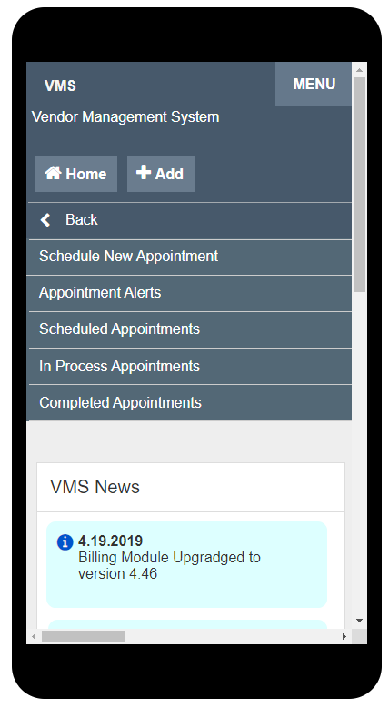

## Recommendations and Next Steps

Based on this round of testing, the following patterns were found to be problematic for enough participants to necessitate retesting or design refinements:

- Mega-Select (Radio)
- Advanced Table Filtering
- Date and Time

Pattern recommendations based on the findings are below.

| Pattern  | Recommendation  |  Rationale  |
|---|---|---|
|PRO Template Responsive Navigation|Keep design as tested.|No major issues.|
|PRO Template Drop Down (Mega Menu) Tab|Keep design as tested.|No major issues.|
|PRO Template Collapsible Panels|Keep design as tested.|No major issues.|
|Date and Time|Conduct additional research to determine if this pattern is needed in the design system.|No issues with testing. However, the pattern is not used often and may not be needed.|
|Mega-Select (Radio)|Add vertical scrolling.|Participants preferred to scroll down rather than paginate.|
|Advanced Table Filtering|Remove the Column Settings and re-test on its own.|Some participants expected to locate the filter inside the Column Settings.|
|Table (Column Selector)|Keep design as tested.|No major issues.|
|Summary (Show/Hide)|Keep design as tested.|No major issues.|
