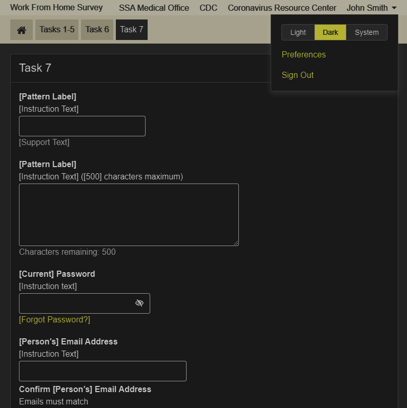

# Round 19 UEF Pattern Testing Usability Findings

Results overview from Round 19 of the user feedback sessions

## Background

The User Experience Framework (UEF) team conducted usability testing to evaluate specific UEF patterns in the context of a non-linear Public Template application prototype on desktop and mobile. The following patterns were evaluated in Round 19 Testing:

- PRO Template Themes
- Badge with Border
- Show/Hide with Badge
- Figure
- Summary (Show/Hide)
- Mega-Select (Radio)
- Mega-Select (Check)
- Table
  - Chart View
  - Advanced Filter
  - Column Settings
    - Reorder
    - Show/Hide
- Template (Dark Mode)
- Button (Toggle)

## Methodology

The User Experience Group (UXG) User Experience Framework (UEF) team conducted usability testing with 18 participants from the SSA community on September 14-18, 2020. The evaluations took place remotely via Skype Sessions. Evaluations were conducted on desktop computers and a mobile emulator. Five participants tested on mobile and 13 tested on desktop.

During each evaluation, participants walked through a series of scenarios that allowed them to look at each of the patterns being tested. The prototype design was a fictitious healthcare website. The prototype was built with HTML and Axure.

After the evaluations were complete, the team analyzed the results including:

- Facilitator Guide metrics on ease of use;
- Participant issues or comments regarding specific UEF patterns or screen details;
- User satisfaction scores on the overall experience as indicated in the post-test questionnaire.

## Participant Information

The UEF Team gathered demographic information from the participants, which includes the following:

- Eleven participants were female, seven were male.
- Participants were between the ages of 26 and 70 with an average range of 36-55.
- Seventeen participants had a degree of higher education (4-year or graduate)
  - Seven participant had a graduate degree
  - Ten participants had a 4-year degree
- All participants use the internet outside of work on a daily or weekly basis.
- Twelve participants consider themselves an expert with a computer. Six self-reported to have intermediate experience.
- Eight participants access the internet on all three devices: Desktop, Tablet and Smartphone.
- All participants own a mobile device:
  - All participants own a Smartphone
  - Seven participants own a Tablet
  - Two participants own an eBook Reader (i.e. Kindle or Nook)
- Most participants (11/18) have been employed with SSA for 10 to 20 years.
- The time participants have been in their current position ranges from under 5 years to 20 years. One participants has been in their current position for over 20 years.

## Metrics

Metrics for this usability test were established by the UEF Workgroup as follows. Each has a target of 80%.

- Completion Rate – Percentage of participants who successfully completed the application without assistance
- Ease of Use – Percentage of participants who indicated the application was “easy” or “very easy” to use, as measured by Questions #3, #5, and #8 of the post-test survey
- User Satisfaction – Percentage of participants who indicated they were “satisfied” or “very satisfied,” as measured by questions #4 and #7 of the post-test survey

## What We Learned

Metrics for task completion, ease of use and user satisfaction, as measured by the post-test questionnaire, were as follows:

| Metric  | Target  | Actual  |
|---|---|---|
|Completion Rate|> 80%|100%|
|Ease of Use|> 80%|88%|
|User Satisfaction|> 80%|81%|

### Qualitative Assessment

This section discusses the usability issues, as well as observations and participant comments. The patterns tested within this evaluation group the findings.

#### **Pro Template Themes**

1. All participants successfully understood the different themes.
2. Most participants preferred the default theme because it was more professional and easier on the eyes.
3. Some participants felt the Blue color is "not bad" could also be used professionally.
4. Most participants felt the red and purple colors were not professional for work applications as red is the color for urgency or errors.

|Theme|Preferred|
|--|--|
|Default|7|
|Blue|5|
|Red|1|
|Purple|2|
|No Response|3|

#### **Badge (w/Border) (Readability)**

1. 17 out of 18 (94%) participants had no issues.
2. Most participants noticed the badge right away and stated that it stood out to them.
3. Some participants stated that they didn't comment on the badge because it was the first time seeing the site and the context didn't mean much to them.
4. One participant did not notice the badge the first time.

#### **Figure**

1. 17 out of 18 (94%) participants understood the figure was an image.
2. 15 out of 18 (83%) participants successfully identified the caption.
3. Seven participants stated that the caption font size was too small to read.
Two participants commented that they would expect to enlarge or zoom in on the image.
4. Two participants suggested adding a zoom feature to read the image more clearly. While one participant stated that he would use the pinch and zoom feature on the phone.
5. Two participants suggested putting the caption on the top of the image to stand out more.

#### **Mega-Select (Check)**

1. 16 out of 18 (89%) participants used the scroll bar to view all options.
2. 17 out of 18 (94%) participants successfully saved the selections.
3. Four participants did not see the scroll bar initially.
4. Two participants suggested to have all the options listed out instead of scrolling.
5. Three participants wanted to see the options alphabetized.
6. Three participants suggested adding an "Other" option to include something not listed.
7. Two participants tried to use the search feature. *This was not functional in the prototype*
8. One participant felt that the search didn't belong if you have a predefined list.
9. One participant suggested a reset button.

#### **Mega-Select (Radio)**

1. All participants used the scroll bar to view all options.
2. All participants successfully selected the save button.
*This data may be due to the fact that participants had previously used the checked version on the prior screen in the prototype.*
3. Most participants did not expect a modal when selecting states and suggested a drop list. *Context of the prototype may have been an issue in this case.*
4. Participants liked this version better because it was in alphabetical order.
5. One participant mentioned that it was confusing to have the "0 Selected" language in the button since that implies that more than one option can be selected.

#### **Summary Show/Hide with Badge**

1. 15 out of 18 (83%) successfully expanded and collapsed the tabs, 3 had difficulty.
2. 18 out of 18 (100%) participants understood the badge.
3. Five participants expected to see the sections expanded by default.
4. When asked about the meaning of the colors, most participants commented on the green status and knew that it was complete and "good to go!"
5. Most participants would expect to see a similar badge in yellow or red that said incomplete if the section was not complete and the section would be expanded by default.
6. Participants mentioned that they thought the sections were closed by default to either save space or for security reasons.
7. One participant felt that if there are more than three sections then it is fine to collapse as it can be cumbersome to have so many items open.

#### **Table (Advanced Filter)**

1. 14 out of 18 (77%) participants successfully located the filter.
2. Six participants used the Search feature before trying the Filter tab.
3. Three participants on mobile devices did not expect the filter to be located under "Settings".
4. One participant missed the add-on features (i.e Filter, Settings, Chart View) entirely and preferred to interact directly with the table.
5. Many participants were confused by the additional tabs with Filter (i.e. Settings and Chart View) and did not understand the difference.
6. When asked about the icon, responses were mixed between it is unfamiliar and does not mean anything to them versus they had seen it before and was a common filter icon.

#### **Table (Column Settings)(Reorder, Show/Hide)**

>*Three participants did not complete this task due to time constraints.*
>
>*Participants had previously seen Column Settings during the Advanced Filter task, which may have skewed data.*

1. 12 out of 15 (80%) participants had no issues.
2. Three participants on mobile devices had issues locating the Column Settings because they did not expect to find it under a button called "Settings".
3. Most participants stated that it was easy to add and remove columns from the table.
4. One participant mentioned that the button label was not clear and suggested renaming it to "Modify Columns or Select Columns".
5. Some participants, whom commented on the color, mentioned that they did not expect green for the columns since green is typically associated with success or completion.

#### **Table (Chart View)**

1. 17 out of 18 (94%) participants had no issues
2. Seven participants mentioned that the charts were easy to understand and helpful.
3. Five participants felt confused due to the context of the chart because the example provided didn't match the table data and were unsure what the numbers represented.
4. Three participants on mobile successfully expanded the chart to view full screen. One mobile participant wanted to pinch to zoom.
5. Two participants did not like that the only color used was blue and wanted the charts to be more colorful.

#### **Button (Toggle) – A/B/C Testing**

1. There were no major issues with this task.

|Design|Preferred|Comments|
|--|--|--|
|Design 1|8|Indicator icon is too small|
|Design 2|4|Participants that picked #2 liked both 1 and 2 but thought the indicator was too small on #1|
|Design 3|0||
|Design 4|0||
|Design 5|4|Participants felt this design was simple|
|Design 6|1|Participant felt this design was more modern|

#### Template Dark Mode and Toggle

1. Ten participants did not expect to find the dark mode toggle controls under the username and wanted the control to be on a separate Preferences or Settings page.
2. Five participants stated that they did not like the dark mode because it was too dark and difficult for them to read.
3. Four participants stated that they liked the dark mode and was easy to read.
4. One mobile participant expected the controls to be at the system level for Android and not on the page at all.
5. One participant stated that it was easy to toggle between the settings.
6. One participant felt the black color needed to be darker and the white colors needed to be brighter.

## Recommendations and Next Steps

Based on this round of testing, the following patterns were found to be problematic for enough participants to necessitate retesting or design refinements:

- Mega-Select (Radio)
- Table (Advanced Filter)
- Table (Column Selector)
- Table (Chart View)

Pattern recommendations based on the findings are below.

| Pattern  | Recommendation  |  Rationale  |
|---|---|---|
|Pro Template Themes|- Move forward with all tested theme colors.   - Create CSS variables for all colors.|No major issues with this pattern.|
|Badge with Border|Continue with design as tested.|No major issues with this pattern.|
|Show/Hide with Badge|Continue with design as tested.|No major issues with this pattern.|
|Figure|Continue with design as tested.|No major issues with this pattern.|
|Summary (Show/Hide) Mobile|Continue with design as tested.|No major issues with this pattern.|
|Mega Select (Radio)|Continue with design as tested.|Most participants had no issues. Those who had difficulty wanted to use the Search feature.|
|Mega Select (Check)|Conduct additional research with different use case.|Participants did not expect a Radio List within a modal and preferred a drop list.|
|Button (Toggle)|Continue with the Toggle design that includes the arrow indicator.|Participants felt that the indicator helped show which item was selected.|
|Table (Advanced Filtering)|Redesign mobile interface.|Participants on mobile devices did not expect a filter to be under the "Settings" button.|
|Table (Column Settings)|Redesign mobile interface.|Participants on mobile devices did not expect a filter to be under the "Settings" button.|
|Table (Chart View)|- Re-test with different context.   - Redesign mobile interface.|- Participants didn't understand the context of the charts.   - Participants had difficulty understanding the different settings on mobile view.|
|Template Dark Mode|- Re-test with dark mode designs. - Place dark mode toggle within a separate preferences page.|- Some participants had difficulty with the colors used in this example. - Participants expected the toggle to be in a separate Preferences or Settings page.|
