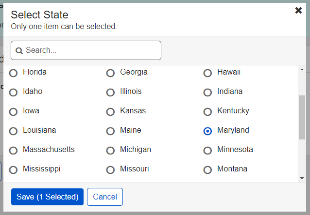

# Round 19 UEF Pattern Testing Usability Findings

Results overview from Round 19 of the user feedback sessions

## Background

The User Experience Framework (UEF) team conducted usability testing to evaluate specific UEF patterns in the context of a non-linear Public Template application prototype on desktop and mobile. The following patterns were evaluated in Round 19 Testing:

- PRO Template Themes
- Badge with Border
- Show/Hide with Badge
- Figure
- Summary (Show/Hide)
- Mega-Select (Radio)
- Mega-Select (Check)
- Table
  - Chart View
  - Advanced Filter
  - Column Settings
    - Reorder
    - Show/Hide
- Template (Dark Mode)
- Button (Toggle)

## Methodology

The User Experience Group (UXG) User Experience Framework (UEF) team conducted usability testing with 18 participants from the SSA community on September 14-18, 2020. The evaluations took place remotely via Skype Sessions. Evaluations were conducted on desktop computers and a mobile emulator. Five participants tested on mobile and 13 tested on desktop.

During each evaluation, participants walked through a series of scenarios that allowed them to look at each of the patterns being tested. The prototype design was a fictitious healthcare website. The prototype was built with HTML and Axure.

After the evaluations were complete, the team analyzed the results including:

- Facilitator Guide metrics on ease of use;
- Participant issues or comments regarding specific UEF patterns or screen details;
- User satisfaction scores on the overall experience as indicated in the post-test questionnaire.

## Participant Information

The UEF Team gathered demographic information from the participants, which includes the following:

- Eleven participants were female, seven were male.
- Participants were between the ages of 26 and 70 with an average range of 36-55.
- Seventeen participants had a degree of higher education (4-year or graduate)
  - Seven participant had a graduate degree
  - Ten participants had a 4-year degree
- All participants use the internet outside of work on a daily or weekly basis.
- Twelve participants consider themselves an expert with a computer. Six self-reported to have intermediate experience.
- Eight participants access the internet on all three devices: Desktop, Tablet and Smartphone.
- All participants own a mobile device:
  - All participants own a Smartphone
  - Seven participants own a Tablet
  - Two participants own an eBook Reader (i.e. Kindle or Nook)
- Most participants (11/18) have been employed with SSA for 10 to 20 years.
- The time participants have been in their current position ranges from under 5 years to 20 years. One participants has been in their current position for over 20 years.

## Metrics

Metrics for this usability test were established by the UEF Workgroup as follows. Each has a target of 80%.

- Completion Rate – Percentage of participants who successfully completed the application without assistance
- Ease of Use – Percentage of participants who indicated the application was “easy” or “very easy” to use, as measured by Questions #3, #5, and #8 of the post-test survey
- User Satisfaction – Percentage of participants who indicated they were “satisfied” or “very satisfied,” as measured by questions #4 and #7 of the post-test survey

## What We Learned

Metrics for task completion, ease of use and user satisfaction, as measured by the post-test questionnaire, were as follows:

| Metric  | Target  | Actual  |
|---|---|---|
|Completion Rate|> 80%|100%|
|Ease of Use|> 80%|88%|
|User Satisfaction|> 80%|81%|

### Qualitative Assessment

This section discusses the usability issues, as well as observations and participant comments. The patterns tested within this evaluation group the findings.

#### **Pro Template Themes**

1. All participants successfully understood the different themes.
2. Six participants preferred the default theme.
3. Six participants preferred the blue theme.
4. Three participants preferred the purple theme.

> Three participants did not respond to the preference data question.

**Theme Specific Quotes:**

Default

- It’s the standard. Nothing wrong with it, just boring.
- SSA work-life
- Most consistent to SSA colors

Blue

- Blue is not bad
- Standard
- Hard to see that tabs are clickable

Red

- Not a fan of the red. It’s more of a burnt orangey red.
- A little pep
- Indicates warning and errors, hard to see that tabs are clickable

Purple

- Nice cool color. An eye grabber.
- For people who want to switch it up a bit.
- Not preferable for SSA pages, more for Power Point docs
- It makes me feel happy

#### **Badge (w/Border) (Readability)**

1. 17 out of 18 (94%) participants had no issues.
2. Most participants noticed the badge right away and stated that it stood out to them.
3. Some participants stated that they didn't comment on the badge because it was the first time seeing the site and the context didn't mean much to them.
4. One participant did not notice the badge the first time.

#### **Figure**

1. 17 out of 18 (94%) participants understood the figure was an image.
2. 15 out of 18 (83%) participants successfully identified the caption.
3. Seven participants stated that the caption font size was too small to read.
Two participants commented that they would expect to enlarge or zoom in on the image.
4. Two participants suggested adding a zoom feature to read the image more clearly. While one participant stated that he would use the pinch and zoom feature on the phone.
5. Two participants suggested putting the caption on the top of the image to stand out more.

#### **Mega-Select (Check)**

1. 16 out of 18 (89%) participants used the scroll bar to view all options.
2. 17 out of 18 (94%) participants successfully saved the selections.
3. Four participants did not see the scroll bar initially.
4. Two participants suggested to have all the options listed out instead of  scrolling.
5. Three participants wanted to see the options alphabetized.
6. Three participants suggested adding an "Other" option to include something not listed.
7. Two participants tried to use the search feature. *This was not functional in the prototype*
8. One participant felt that the search didn't belong if you have a predefined list.
9. One participant suggested a reset button.

#### **Mega-Select (Radio)**

1. All participants used the scroll bar to view all options.
2. All participants successfully selected the save button.
*This data may be due to the fact that participants had previously used the checked version on the prior screen in the prototype.*
3. Most participants did not expect a modal when selecting states and suggested a drop list. *Context of the prototype may have been an issue in this case.*
4. Participants liked this version better because it was in alphabetical order.
5. One participant mentioned that it was confusing to have the "0 Selected" language in the button since that implies that more than one option can be selected.

#### **Summary Show/Hide with Badge**

1. 15 out of 18 (83%) successfully expanded and collapsed the tabs, 3 had difficulty.
2. 18 out of 18 (100%) participants understood the badge.
3. Five participants expected to see the sections expanded by default.
4. When asked about the meaning of the colors, most participants commented on the green status and knew that it was complete and "good to go!"
5. Most participants would expect to see a similar badge in yellow or red that said incomplete if the section was not complete and the section would be expanded by default.
6. Participants mentioned that they thought the sections were closed by default to either save space or for security reasons.
7. One participant felt that if there are more than three sections then it is fine to collapse as it can be cumbersome to have so many items open.

#### **Table (Advanced Filter)**

1. 14 out of 18 participants successfully located the filter.
2. Two participants on mobile devices did not expect the filter to be located under "Settings".

2. P1: I’m familiar with filters so that’s where I went first. Unsure what column settings and chart view mean.
3. P2: The filter icon is familiar, they have seen it before.

5. P9: I don’t think it was difficult, I prefer the term “Search” instead of filtering. I was able to filter on any of these fields.
6. P11: I like how it was presented.

#### **Table (Column Settings)(Reorder, Show/Hide)**

1. 12/13 Desktop participants had no issues (1 participant had difficulty).
2. P1: pretty straightforward, easy.  Green is good.
3. P3: She removed columns quickly, no problems. Instructional icons next to the action they control instead. Click on X and apply to table. Green means go or money. It’s good. Safe color in this scenario.
4. P7:  would prefer to reorder columns in the actual table.
5. P9: Removing the columns was easy. The green color stands out.
6. P13:  It was simple.
7. P15:  liked it self-explanatory. Thought green color was ugly, not favorite shade of green.
8. P16:  Click and drag fine
9. P17:  Very easy

#### **Table (Chart View)**

1. 17/18  participants had no issues ( 1participant had difficulty)
2. P3 : Wants another color. Blue is already in the heading and used in links. Maybe purple or gray or something. Do another color (we already have blue in the top), Easy to read.
3. P7:  Looks fancy
4. P10: Liked to enlarge the bar chart
5. P12: Charts are very useful for comparing
6. P15: Easy to read. Understands what it is saying.
7. P16: Prefers the bar graph and it’s fine.
8. P17: Easy to understand. Would click on the bar, line or pie. All of these graphics provide me with info. After expanding the Bar chart, even better.
9. P18: He likes the chart easier to read, pie charts are hard to read but bar charts are good.

#### **Button (Toggle) – A/B/C Testing**

1. 18/18 participants had no issues
2. P1:  1 - I like it because it fills the whole area and it’s got the little indicator. No confusion, very clear.
3. P2:  The arrow implies the selection was made. The third option does this well, too. But I like the 1st option better.
4. P3: Likes both 1 and 2, lens towards 2. Likes the indicator arrow, but is too small.
5. P4: Looks more completed to me (number 1 has arrow that barely visible) 1 and 2
6. P8: I liked 1 or 2. The triangle in number 1 makes me think something is wrong with my screen. Definitely prefer number 2

#### Template Dark Mode

## Recommendations and Next Steps

Based on this round of testing, the following patterns were found to be problematic for enough participants to necessitate retesting or design refinements:

- Pro Template Header Links
- Mega-Select (Radio)
- Mega-Select (Check)
- Table ( Advanced Filter, Column Selector, Chart View)

Pattern recommendations based on the findings are below.

| Pattern  | Recommendation  |  Rationale  |
|---|---|---|
|PRO Template Themes|Keep design as tested.|Keep Default, Blue and Purple Themes. Make CSS variable for all colors.|
|PRO Template Header Links|More research needed.||
|Badge (W/Border) Readability|Keep design as tested.||
|Show/Hide with Badge|Keep design as tested.||
|Figure|Keep design as tested.||
|Summary (Show/Hide) Mobile|Keep design as tested.||
|Mega Select (Radio)|More research is needed.||
|Mega Select (Check)|More research is needed.||
|Button (Toggle)|Keep Toggle button with arrow indicators.||
|Table (Advanced Filtering)|More research is needed.||
|Table (Column Settings)|More research is needed.||
|Table (Chart View)|More research is needed.||
