# Round 20 DST Component Testing Usability Findings

Results overview from Round 20 of the user feedback sessions

## Background

The Design System Team (DST) conducted usability testing to evaluate specific patterns in the context of an unmoderated Template application prototype on desktop devices. The following patterns were evaluated in Round 20 Testing:

- Textbox with Autocomplete
- Smart Search
- Lists (Static)
- Lists (Drag and Drop)
- Container (Drag and Drop Rows)
- Negative Number Formatting
- Re-Entry Number
- Table Sorting
- Dark Mode
- Page Template Header

## Methodology

Due to working remotely, the Design System Team (DST) conducted unmoderated usability testing on February 22- March 5, 2020. The evaluations took place remotely via an unmoderated testing platform created by the team for this purpose. Twenty-six participants were recruited internally due to limited access to the public during the pandemic. An email was sent out to employees in the SSA Office of Systems asking for remote participation in the study. Participants were provided a link to the testing platform where they were asked to read and sign an informed consent form. In the task area of the prototype, participants were walked through a series of tasks. Each task page provided instructions, what was being tested, and a feedback form that collected Satisfaction User Scores (SUS). The scores were rated on a scale of 1-7, 1 being very difficult and 7 being very easy. The Design System Team aims for a Satisfaction User Score greater than or equal to five for each component in addition to examining user comments. All evaluations were conducted on desktop computers. Tasks that required feedback for mobile used an emulator.

After the evaluations were complete, the team analyzed the results including:

- Facilitator Guide metrics on ease of use;
- Participant issues or comments regarding specific UEF patterns or screen details.

## Participant Information

31 participants were involved in the evaluations. Their demographic information was as follows:

- 16 Female and 15 Male
- Age ranges include:
  - 19 were 36-55 years old
  - 7 were 55-72 years old
  - 4 were 26-35 years old
- Education experience includes:
  - 11 participants have a graduate degree
  - 15 participants have a 4 year degree
  - 2 participants have a 2 year degree
  - 2 participants have some college education
  - 1 participants have a high school diploma
- Participants own the following SmartPhones:
  - 21 own an Android
  - 10 own an iPhone
- Participants own the following Tablets:
  - 18 own an iPad
  - 2 own an Android tablet
  - 1 owns a Windows tablet
  - 1 owns an eBook Reader (e.g. Kindle, Nook)
  - 8 do not own a tablet

## Metrics

Design System Team established System Usability Score (SUS) metrics. Metrics were based on a scale of 1 to 7 with one being very difficult and seven being very easy.

Below is the average outcome of the System Usability Scores (SUS):

| Metric  | Target  | Actual  |
|---|---|---|
|Text Box with Autocomplete|>=5|6.00|
|Smart Search|>=5|5.00|
|Static Lists|>=5|6.00|
|Drag and Drop Lists|>=5|4.19|
|Drag and Drop Container Rows|>=5|4.50|
|Negative Numbers Display|>=5|6.80|
|Re-Entry Number (Redesign)|>=5|6.48|
|Table Sorting|>=5|6.16|
|Dark Mode|>=5|5.70|
|Page Template Header|>=5|6.17|

### Qualitative Assessment

This section discusses the usability issues, as well as participant comments. The patterns tested within this evaluation group the findings.

#### **Text Box with Autocomplete**

Application teams expressed the need for user-aided search in the form of an autocomplete feature. When the user begins to type, a menu appears with suggested search keywords or phrases.

Average SUS score of 6 out of 7

- This pattern tested well with no major issues.
- There were some prototype issues that caused confusion such as not allowing the user to press enter to populate the selected search term into the text box. Since this is the way it will work when implemented we do not see this as an issue to move forward with the component.

**Participant comments:**

> One participant commented “I was not able to press Enter and have the selection show up in the list. The droplist continued to be displayed even when I pressed the Enter key, which was counter-intuitive. I was expecting the Enter key to select from the options.”
>
>Another participant said “The text I selected did not appear in the text box. I thought it would.”
>
>Another participant also said “I saw the result I wanted but when I selected it I expected the whole name to populate the box (100: Developing....etc). Instead it just showed 100 so I wasn't sure if that was there from me typing it or if it had accepted my selection of the policy itself.”
>
>Overall participants liked the auto complete search feature.
>
> One participant said “I think that the ability to search for what you are looking and also select it from a list of accepted options makes it easier to find what you need without having all of the details.”

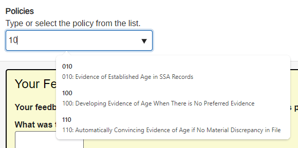

#### **Smart Search**

Many Agency applications have a consistent need to search by several different types of criterion (SSN, Name, or some type of number format). This component would allow applications to have a single search text box that uses intelligence to determine the users search criteria.

Average SUS rating of 5 out of 7.

- 16 participants out of 31 participants preferred Option 1 (Selecting search criteria from a dropdown list after typing into the search box.)

**Participant comments:**

Option 1 preference:

> “Although it's easier to be able to use a general smart search field, for specific records like these (i.e. - medical records), it would be helpful to still have a "search by" dropdown that would enable you to limit the search to a particular criteria if necessary (e.g. - if you were searching on a street name, but were getting a large number of results that matched someone's actual name instead).”
>
> “I was more confident that the format of the information I was giving, was correct for returning the result”

- 14 out of 31 participants preferred Option 2 (Entering search term into a text box and simply selecting search without having to filter using a drop down menu.)

Option 2 preference:

> “Not sure if this is beyond the scope of this intended exercise, but Search functionality without Auto-Complete is pretty useless in my opinion.”
>
> “A suggestion would be to have some sort of format to follow for things like a date being searched, as I was looking for the input field to change or provide format guidance when I selected that option.”
>
> “It’s easier to be able to enter whatever search criteria you want in the search field.”

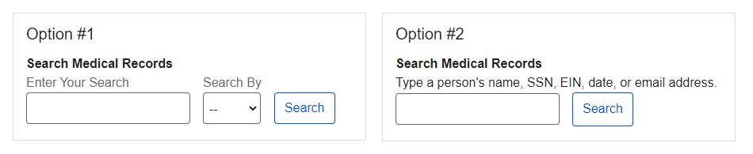

#### **Static Lists**

Static lists would fulfill a need to support horizontal support for lists as well as table of contents type listing. Evaluators were tasked with identifying their current step in a process using the static list component and all responses received were correct.

Average SUS rating  of 6 out of 7.

- Static lists would fulfill a need to support horizontal support for lists as well as table of contents type listing. Evaluators were tasked with identifying their current step in a process using the static list component and 31 out 31  responses received were correct.

**Participant comments:**

> “Identifying the step that has been completed is easy because of the checkmarks for steps 1 and 2. Next step # 3 would be the next process step to be completed, which is Application in Process.”
>
> “Because the first two steps in the application process are shown as completed with tick mark in green color”
>
> “It would be more visually consistent if the shape of the unchecked and checked boxes were the same.”

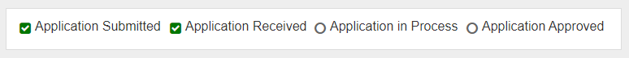

#### **Drag and Drop Lists**

The drag and drop list component would allow users to execute commands on a list item.

Average SUS rating of 4.19 out of 7.

- This was an Axure prototype with many limitations in design such as the ability to demonstrate a “ghost” of where the dragged object will land.
- Participants expected to see a “ghost” image of where the object will land.
- Participants also expected to see animation indicating that the list object landed or was placed in the intended location.

- Participants were asked what they thought of the component and below are their responses:

**Participant comments:**

> “I was not 100% sure that Susan would land where I expected when I let go of the mouse button. I would have liked to see Susan's box move with my mouse, while being dragged.
>
> “Drag & Drop is a nice feature when your site is able to render the literally dragging visually across the screen. The above example is confusing because it does not easily display where the item is being moved. If visual graphics of dragging/dropping can't be used, then up/down arrows would be more appropriate.”
>
> “If the functionality works as expected it's relatively easy to do, but for whatever reason the rearranging didn't work properly (or at least not consistently). When I attempted to drag one entry above another, sometimes it worked, sometimes nothing happened, sometimes I had to drag it higher than the last time, and sometimes it seemed to move the entry somewhere unexpected.”
>
> “The items did not move as I expected them too. It was hard to tell if I had it selected and was able to move it or where it would go when I did move it.”

Icon meaning (The icon was meant to indicate that the list was drag able)"

> Moveable
>
> Grab
>
> Drag & Drop
>
> Click & drag this to rearrange
>
> I guess it's a handle
>
> grab and hold
>
> more options
>
> Select?

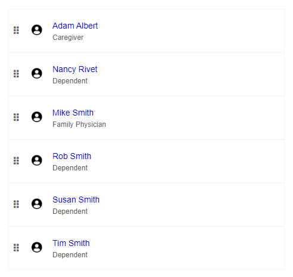

#### **Drag and Drop Container Rows**

Similar to the drag and drop lists, the drag and drop container rows would allow users to move rows within a container.

Average SUS rating of 4.5 out of 7

- This was an Axure prototype with limitations in drag and drop simulation.
- Participants understood that the container rows were drag-able; however due to prototype limitations the experience was not satisfactory for users.
- Participants wanted a clear indication of where the row was going to be moved before releasing the row.
- 17 out of  31 participants said this task was easy (only after having learned the drag and drop functionality from a previous question in the testing prototype; Drag and drop lists)

**Participant comments:**

> “I didn't know "where" to drop the container... the other containers didn't provide any visual clues about "where" the box would be dropped... before or after.”
>
> “The feedback I expect when I'm moving something is, I see a "ghost" of the item in the destination. IN this case, the "move" icon didn't represent moving. And highlighting Lisa Crow is not immediately obvious that I'm dropping Amanda Smith on top of her.”
>
> “It was easy to move but I was not confident that AManda would land where I expected. My first try, I clicked Amanda and dragged until my mouse was over top of Jim. Amanda landed above Jim and I had to try again by selecting the name below Jim.”
>
> “I was able to click in the line near the name (didn't need to use a handle). I still didn't receive any feedback on where it would drop, though. Happily it went where I hoped it would go.”
>
> “Not sure what the difference was....maybe it was because I have already done it once.”
>
> “Detailed instructions are missing”

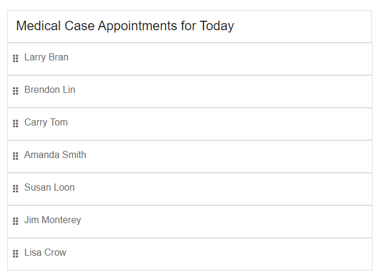

#### **Negative Numbers Display**

The goal of this component is to create a standard for displaying negative numbers for ease of readability.

Average SUS rating of 6.8 out of 7

- 31 out of 31 participants were able to identify the negative number without difficulty

**Participant comments:**

> “The negative sign and the red color”
>
> “The red number and the "-"”
>
> “It's red and has a minus in front of it.”
>
> “-$98,456 - Because it has minus sign in front of the amount”

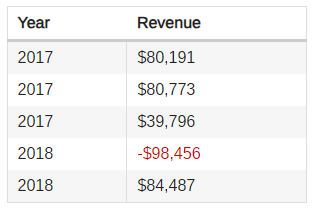

#### **Re-Entry Number (Re-design)**

Based on UEF 2.1 508 Testing results and ASB guidance, the Re-Entry number component needed a red-design, in order to display a number within the label rather than in the middle of the notice.

Average SUS rating of 6.48 out of 7

- 31 out 31 participants had no issues with the component
- The goal of this redesign was to display the Re-Entry number within the label rather than in the middle of the notice, however participants had additional comments in regards to the overall pattern:

**Participant comments:**

> “Consider making the re-entry number a different color in both the heading and body, this may help accentuate its importance”
>
> “When I log back in to complete an incomplete application, I may need this number in order to be able to do that. But it's not clear to me why I would need the number. Also, why does the text say that I may need the number or the website. Can I restart the application without the number as long as I go to www.socialsecurity.gov.? This is confusing.”
>
> “Kind of strange in my opinion to have the instructional text after the information, rather than before. Why is there so much variation in the spacing? Why have the to the left with a heavy indent, and then have the instructional text flush with the border? Why is the second number so large, but not aligned even with the line it's displayed on? Why is instructional text also at the beginning? Is the first box supposed to be re-entry info or re-entry instructions? Not very pleasant to look at.”
>
> “It may be easy for me because I was part of the group which designed (and re-designed and re-re-designed) the reentry pages in multiple applications 15 years ago. Concerned about language, though: it is a "re-entry number" but the task is "restart" the application. Are these synonyms? I would expect a "restart" to be starting over, not coming back. Wouldn't it be clearer to use the same terms consistently?”
>
> “It might be helpful to emphasize that the user should /definitely/ record the number somewhere in case they need it. As written, it sounds like more of a suggestion.”
>
> “I find this too wordy and busy. Too complicated for someone with a short attention span who's focusing on completing a task.”
>
> “Surprisingly obtrusive. My eye did not know where to jump because the number is repeated but varying sizes each time.”
>
> “They are fine – calling it re-entry is odd to me...however, not sure what I'd call it. Maybe, application number ? Can someone randomly guess a re-entry number and pull up someone elses account info??”
>
> “its bold and very seeable”
>
> “The locations of the numbers are okay. It is at the top and then again near the center, and more prominent.”
>
> “It should not say "restart an incomplete application", it should say "resume" or "pick up where you left off".”

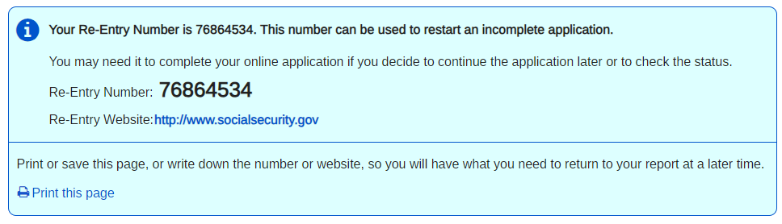

#### **Table Sorting**

The UEF table sort design was updated due to 508 issues. The table sort icon will now be placed immediately to the right of the column header instead of to the far right of the column.

Average SUS rating of 6.16 of 7

- The table sort icon was placed immediately to the right of the column header.
- 6 out of 31 participants commented that although they knew to click on the column header to sort they would have liked to see the sorting icon without taking any action such as selecting the column header.
- Participants commented that they were familiar with the sort functionality because it is similar to other UI’s
- There were no issues with this component.

**Participant comments:**

Sort Icon:

> “It's not 100% obvious that sorting is possible since the Sort icon is not visible until you actually click on the header. I think it should remain present at all times.”
>
> “Graying out the header when it's sorted on that column is confusing. Before clicking on the header, there is NO icon to indicate sorting. Only because I know the UEF convention that underlined headers mean the column is sortable was I able to find the sorting in the first place. This is one area where there may not be a much better solution. At least, I can't think of any obvious improvements.”
>
> “It would be helpful to allow the user to click on the arrows if they want to toggle the sort order, instead of just on the column header itself.”
>
> “An experienced user of different applications and sites would know this, but not everyone would be able to quickly execute this task.”
>
> “I feel like it should appear before I clicked the column header”
>
> “The sorting icon is fine. Why: Similar enough to Excel that it leverages what people already know & expect. You're not trying to reinvent the wheel.”
>
> “The icon is confusing. Why: The way it's shown, I'd expect it to show the current sort order, but it's not (I think). The arrow points down when it's in ascending order. But then, it also points in the direction in which the values increase, so that may make sense. I don't know, it confuses me.”
>
> “It is a clear indication of whether the list is being sorted ascending, descending, or not at all. Why: I'm used to icons like this indicating sort order. The directionality of the arrow helps to make the sort order clear.”
>
> “Pretty good, but I wish the arrows showed up even when I wasn't sorted (and were both greyed out).”
>
> “Standard and normal – it's expected UI behavior to me”
>
> “Pretty standard”
>
> “I am very comfortable with this because I am accustomed to using a similar feature in Excel software. Why: I am comfortable because of frequent previous use of similar feature in Excel software.”
>
> “Easy enough to figure out”
>
> “I dont see an icon until I click the heading in chrome, so I feel it is a bit broken. Why: Hard to tell that the column is sortable in chrome.”

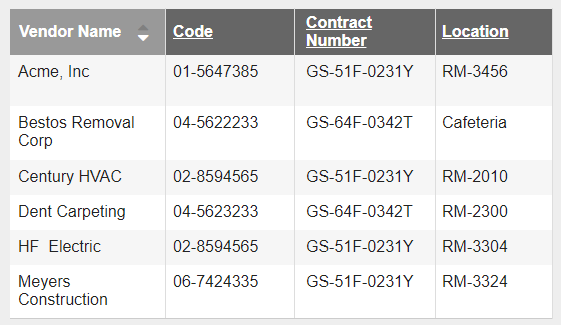

#### **Dark Mode**

The Design System Team will be adding the dark mode feature to reduce the light emitted by device screens while maintaining the minimum color contrast ratios required for readability. The placement of the dark mode toggle control was the focus of the testing.

Average SUS rating of 5.7 out of 7

- Participants had mixed feeling about the ease of accessibility
- Although participants were able to locate the toggle they would have preferred to see the toggle in the top right corner of the page.
- Participants were asked how they felt about the placement of the Dark Mode toggle, and below are their responses

**Participant comments:**

General:

> “It is a good placement. Easy to find at top of screen. Maybe it should be persistent at the top, like doesn’t move when scrolling.”
>
> “It's very easy to find. Almost too easy... I would have expected a Settings drop down with Appearance nested underneath”
>
> “Placement is fine. Because it's in the top-right corner. I don't know that "Appearance" is what I would call it. I feel the standard nowadays is for Appearance to be encompassed within "Settings" (or the Gear icon).
>
> “ok. "Appearance" makes sense. Nice if the ONLY configuration you have is for appearance, but what if you have other settings? This pattern doesn't seem very expandable.”
>
> “Menu options are often located in that general area at the top of the page.”
>
> “Found it difficult to locate. And "Appearance" does not sit right, not sure why...Really dislike the dark mode. Inherently always harder to see but this is a real strain, especially the beige tabs at the top.”
>
> “It should be in the corner. It’s not easy to locate.”
>
> “I think it is in a good place.”
>
> “I think that the placement is where most people would expect to look for the option to adjust such things.”
>
> “I was a little confused initially since Dark Mode was typed on the tab I was looking at. It could seem like the page was already in Dark Mode. Also, I selected Appearance from the menu since there were no other menu options. However, I'm not sure that would have been my first choice if there were other menu options. It might be better to use the same word such as "appearance" or "mode."

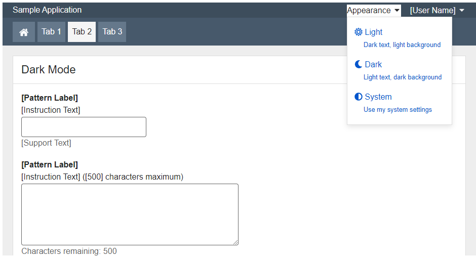

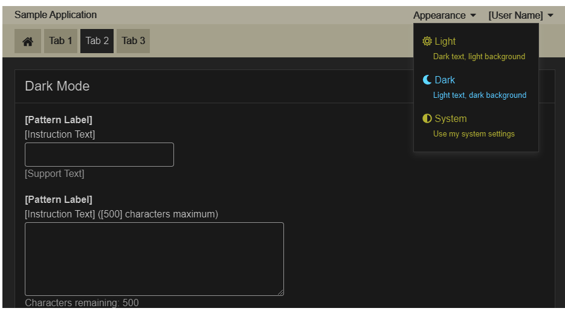

#### **Page Template Header**

Internal applications have a need to show links in the header of the page, outside the existing global options menu.

Average SUS rating of 6.17 out of 7

- Internal applications have a need to show links in the header of the page, outside of the existing global options menu.
- The majority of participants had no issues in locating the About Us link in the header of the page.
- 1 participant expected to see the About Us link at the bottom of the page. (This may have been a context issues) Teams will be able to name the links what they wish.
- No major issues with this component
- Participants were asked how they felt about the placement of the Page Template Header and below are their responses

**Participant comments:**

> “It was good. That is a predictable place to put About Us”
>
> “The About Us location is logical.”
>
> “It's fine. Because it's located somewhere in the top menus.”
>
> “I like the placement.”
>
> “Not a good placement. Shouldn't it be on the left side.”
>
> “Didn't like it I automatically scrolled to the bottom looking for an "About" footer..didn't see it, then I scrolled back up....looked at the tabs, didn't see it there. Finally I landed on the "about Us' in the top right.”
>
> “I think it is fine there. It makes sense to put it as a link at the top of the page so if I need more information I can click it.”

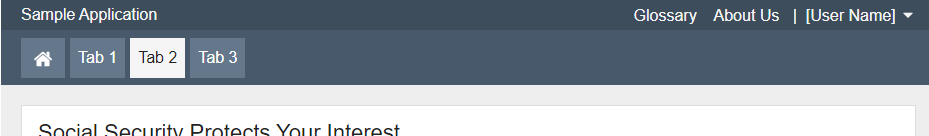

## Recommendations and Next Steps

Based on this round of testing, the following patterns were found to be problematic for enough participants to necessitate retesting or design refinements:

- Lists (Drag and Drop)
- Drag and Drop Container Rows

Pattern recommendations based on the findings are below.

| Pattern  | Recommendation  |  Rationale  |
|---|---|---|
|Text Box with Autocomplete|Keep design as tested.|No major issues with this pattern.|
|Smart Search|Keep design as tested.|No major issues with this pattern.|
|Static Lists|Keep design as tested.|No major issues with this pattern.|
|Drag and Drop Lists|Use a different prototyping method (Adobe XD or HTML) to better illustrate motion design.|The Axure prototype did not reflect motion animations for an adequate test.|
|Drag and Drop Container Rows|Use a different prototyping method (Adobe XD or HTML) to better illustrate motion design.|The Axure prototype did not reflect motion animations for an adequate test.|
|Negative Numbers Display|Keep design as tested.|No major issues with this pattern.|
|Re-Entry number (Redesign)|Keep design as tested.|No major issues with this pattern.|
|Table Sorting|Keep design as tested.|No major issues with this pattern.|
|Dark Mode Toggle|Keep design as tested.|No major issues with this pattern.|
|Page Template Header|Keep design as tested.|No major issues with this pattern.|

<!--## Lessons Learned

DST discussed lessons learned from this round of testing. Those included the following:

- Unmoderated Remote Testing does provide useful, valid feedback, and provides us with another tool in our testing arsenal.
- Reduce the duration of unmoderated testing from two to one week. Since 90% of our test participant results were received within the first 3 days of the start of testing, this will allow us to reduce the cycle time of the entire test process (design, implementation, active testing, analysis, recommendations).
- Since we developed a prototype of an unmoderated testing platform, rebuild the unmoderated testing platform into a more permanent solution that is easier to reuse and extend.
- Due to our lack of a secure (HTTPS) web server to deliver the testing, we had to rely on our existing UXG Web Server and thus could not automate the aggregation and analysis of participant results using Microsoft Forms. Move all future unmoderated testing to our new, secure (HTTPS) UXG Web Application Server and integrate Microsoft Forms into the testing platform.
- For future test designs, everything that looks interactive to a participant should provide some type of feedback, even if just to say what operation would be performed in a real app.-->
