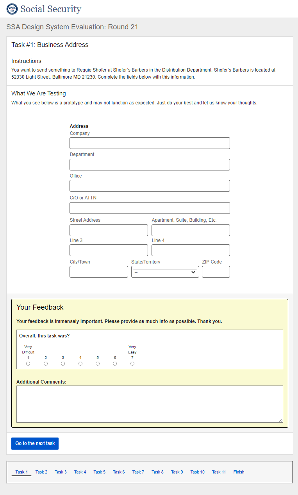

# Round 21 DST Component Testing Usability Findings

Results overview from Round 21 of the user feedback sessions

## Background

The Design System Team (DST) conducted usability testing to evaluate specific patterns in the context of an unmoderated Template application prototype on desktop devices.

The following patterns were evaluated in Round 21 Testing:

- Address (Business)
- Container (Drag and Drop Rows)
- International Address with Toggle
- Multi-Select
- Lists (Drag and Drop)
- Table Sort Icon and Row Banding
- Table Advanced Filter
- Table Column Customization
- Table Mobile Layout Sort
- Table Mobile Layout Advanced Filter
- Table Mobile Layout Column Customization

## Methodology

Due to working remotely, the Design System Team (DST) conducted unmoderated usability testing on August 27, 2021. The evaluations took place remotely via an unmoderated testing platform created by the team for this purpose. Twenty-six participants were recruited internally due to limited access to the public during the pandemic. An email was sent out to employees in the SSA Office of Systems asking for remote participation in the study. Participants were provided a link to the testing platform where they were asked to read and sign an informed consent form. In the task area of the prototype, participants were walked through a series of tasks. Each task page provided instructions, what was being tested, and a feedback form that collected Satisfaction User Scores (SUS). The scores were rated on a scale of 1-7, 1 being very difficult and 7 being very easy. The Design System Team aims for a Satisfaction User Score greater than or equal to five for each component in addition to examining user comments. All evaluations were conducted on desktop computers. Tasks that required feedback for mobile used an emulator.

After the evaluations were complete, the team analyzed the results including:

- Facilitator Guide metrics on ease of use.
- Participant issues or comments regarding specific UEF patterns or screen details.

## Participant Information

Twenty-six participants were involved in the evaluations. One participant did not complete the demographic survey.

Participant demographic information for 25 out of 26 participants were as follows:

- 12 Female and 13 Male
- Age ranges include:
  - 16 were 36-55 years old
  - 8 were 56-72 years old
  - 1 was 26-35 years old
- Education experience includes:
  - 12 participants have a graduate degree
  - 12 participants have a 4-year degree
  - 1 participant had some college

## Metrics

Design System Team established System Usability Score (SUS) metrics. Metrics were based on a scale of 1 to 7 with one being very difficult and seven being very easy.

Below is the average outcome of the System Usability Scores (SUS):

| Metric  | Target  | Actual  |
|---|---|---|
|Address (Business)|>=5|5.76|
|Container (Drag and Drop Rows)|>=5|5.68|
|International Input Field Toggle Update|>=5|5.19|
|Multi-Select|>=5|4.60|
|Lists (Drag and Drop)|>=5|6.00|
|Table Sort Icon and Row Banding|>=5|5.40|
|Table Advanced Filter|>=5|5.95|
|Table Column Customization|>=5|5.95|
|Table Mobile Layout Sort|>=5|3.90|
|Table Mobile Layout Advanced Filter|>=5|5.70|
|Table Mobile Layout Column Customization|>=5|4.10|

### Qualitative Assessment

This section discusses the usability issues based on participant comments and tasks performed.

All the percentages below are based off the number of participants (26)

#### **Address (Business)**

88% of participants scored 5 and above.

- Two participants (8%) expressed using autocomplete feature
- Ten participants (38%) expressed their concerns that they could not tab through address fields (*prototype issue*).
- Three participants (11.5%) expressed confusion around the "Office", "Department", and "C/O Attn" fields.
- One participant (4%) suggested renaming the title from Address to Business Information.
- One participant (4%) felt it was too many fields for an Address.

#### **Container (Drag and Drop Rows)**

81% of participants scored 5 and above.

- Seven participants (27%) expressed that the icon did not mean anything to them.
- Nine participants (35%) thought that the icon was to perform an action, move, grab, or drag.
- Four participants (15%) expressed that the change in cursor on hover gave them a clue that an action could be done.
- One participant (4%) suggested using up and down arrows for the icon.
- One participant (4%) thought the icon looked like the Microsoft waffle.
- One participant (4%) was unsure if the action could be completed with a keyboard only for accessibility.

#### **International Input Field Toggle Update**

69% of participants scored 5 and above.

- Seven participants (27%) expressed confusion around how the address was displayed in the scenario. They were unsure what to put for the zip code and if "HONG KONG" was a region or a country

>1422 Shang Lung Road 
>Kowloon City 
>HONG KONG 

- Seven participants (27%) expressed their concerns about tabbing between the fields. (*prototype issue*)
- Four participants (15%) expressed that a line is missing to indicate who the correspondence is addressed to.

#### **Multi-Select**

62% of participants scored 5 and above.

- Eight participants (31%) expressed their concern that they could not search. (*prototype issue*)
- Eight participants (31%) expressed that the selected count was not displayed right. (*prototype issue*)
- One participant (4%) expressed to see just one column displayed alphabetically and avoid scrolling up and down to search for the book.
- One participant (4%) was not able to complete the task.

#### **Lists (Drag and Drop)**

77% of participants scored 5 and above.

- The comments received around icon were similar to the Container Drag and Drop.
- Four participants (15%) expressed that they knew what to do because of performing the container drag and drop task.

#### **Table Sort Icon and Row Banding**

69% of participants scored 5 and above.

- 24 participants (92%) provided the correct answer to the question asked.
- 12 participants (46%) expected the arrow icons be clickable.
- Two participants (8%) expressed that they knew the icon was rotating through three choices: default, ascending, and descending.
- One participant (4%) expressed that they had to click multiple times
- One participant (4%) was unsure on how the sorting worked (i.e. ascending, descending and what?)
- One participant (4%) felt there were missing instructions for the feature but liked the functionality once they figured it out.

#### **Table Advanced Filter**

81% of participants scored 5 and above.

- 24 participants (92%) provided the correct answer to the question.
- Three participants (11.5%) tried the column settings and search but expressed that it did not work for them. (*search was not functional in the prototype*)
- Three participants (11.5%) expressed that the instructions were helpful.
- Two participants (8%) expressed that the "Rating" list option should not be ">=4" and could have been "4+" or "4 or More".
- One participant (4%) expressed a need for instructions.
- One participant (4%) expected the filter to be similar to Microsoft Excel with a "multi-filter".

#### **Table Column Customization**

77% of participants scored 5 and above.

- 17 participants (65%) did not provide any comments
- One participant (4%) wanted the entire pill to be clickable instead of just the icon to remove a column.
- One participant (4%) suggested to rename the tab from Column Settings to “Customize Column Settings”

#### **Table Mobile Layout Sort**

38% of participants scored 5 and above.

- 15 participants (58%) did not provide the correct answer to the question.
- Eight participants (31%) expressed concern in finding the sort option.
- 13 participants were confused with the sort results and finding the sort icon.
- One participant thought it was straight forward.

#### **Table Mobile Layout Advanced Filter**

81% of participants scored 5 and above.

- Seven participants (27%) provided an incorrect answer to the question.
- Four participants (15%) did not expect the first row to be the only row expanded after applying the filter.
- Four participants (15%) tried to search instead of using the filter option.
- Two participants (8%) wanted to see the number of results returned after applying the filter.

#### **Table Mobile Layout Column Customization**

42% of participants scored 5 and above.

- No comments were captured for this task

## Recommendations and Next Steps

Based on this round of testing, the following patterns were found to be problematic for enough participants to necessitate retesting or design refinements:

- Table Mobile Layout Sort
- Table Mobile Layout Advanced Filter
- Table Mobile Layout Column Customization

Pattern recommendations based on the findings are below.

| Pattern  | Recommendation  |  Rationale  |
|---|---|---|
|Address (Business)|Keep design as tested.|No major issues found.|
|Container (Drag and Drop Rows)|Keep design as tested.|No major issues found.|
|International Input Field Toggle Update|Keep design as tested.|No major issues found.|
|Multi-Select|Keep design as tested.|No major issues found.|
|Lists (Drag and Drop)|Keep design as tested.|No major issues found.|
|Table Sort Icon and Row Banding|Keep design as tested.|No major issues found.|
|Table Advanced Filter|Keep design as tested.|No major issues found.|
|Table Column Customization|Keep design as tested.|No major issues found.|
|Table Mobile Layout Sort|DST will work on improvements for a smoother user experience.|The mobile simulation was not clear enough for users to evaluate.|
|Table Mobile Layout Advanced Filter|DST will work on improvements for a smoother user experience.|The mobile simulation was not clear enough for users to evaluate.|
|Table Mobile Layout Column Customization|DST will work on improvements for a smoother user experience.|The mobile simulation was not clear enough for users to evaluate.|

<!--## Lessons Learned

DST discussed lessons learned from this round of testing. Those included the following:

- How we word both the communications that go out to potential participants and the Welcome page may have significant impact on the number of test participants we actually get. Allow everyone to participate, regardless of past participation.
- The more Tasks we include in an evaluation, the slower the evaluation web site becomes, since the unmoderated Test Platform is a Single-Page Application (SPA). (And yes–it's already using lazy loading to try to speed things up.) Since we have had evaluations with 10 and 11 tasks, let's try to keep the next evaluation round to 8 or less and monitor the response times.
- For the next evaluation, we may want to try using a SHE (Shared Hosting Environment) server, since we have direct control over that type of server and those servers are optimized for speed.
- Emphasize even more that this is strictly a prototype and not everything will fully function.
- Not everyone looks at the DCS Communications emails - maybe have it go directly to the branches so the branch chief can distribute to their personnel directly.
- Send reminder half way through to get more responses
- Add information about providing details for the UXG Evaluation Participation badge
- Reach out to OLMER/MSS for union consent ASAP to avoid pushing dates back 0.851 CTR working 25% with UXG-->
