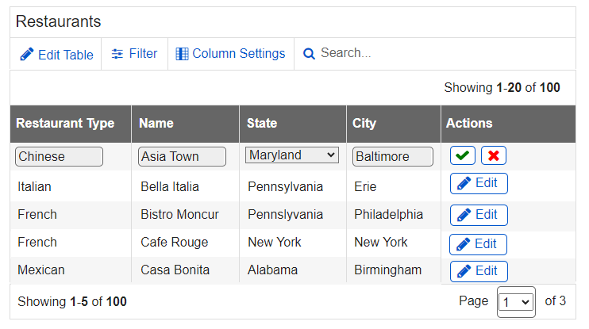
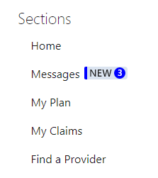

# Round 22 DST Component Testing Usability Findings

Results overview from Round 22 of the user feedback sessions

## Background

The Design System Team (DST) conducted usability testing to evaluate specific patterns in the context of an unmoderated Template application prototype on desktop devices.

The following patterns were evaluated in Round 21 Testing:

- Alert
- Confirmation Number
- Tooltip
- Button Placement
- Inline Editing
- Switch
- Card
- Tag
- Pill
- Table Column Customization

## Methodology

Due to working remotely, the Design System Team (DST) conducted unmoderated usability testing on March 28, 2022. The evaluations took place remotely via an unmoderated testing platform created by the team for this purpose. Twenty-six participants were recruited internally due to limited access to the public during the pandemic. An email was sent out to employees in the SSA Office of Systems asking for remote participation in the study. Participants were provided a link to the testing platform where they were asked to read and sign an informed consent form. In the task area of the prototype, participants were walked through a series of tasks. Each task page provided instructions, what was being tested, and a feedback form that collected Satisfaction User Scores (SUS). The scores were rated on a scale of 1-7, 1 being very difficult and 7 being very easy. The Design System Team aims for a Satisfaction User Score greater than or equal to five for each component in addition to examining user comments. All evaluations were conducted on desktop computers. Tasks that required feedback for mobile used an emulator.

The prototype was redesigned to match the new release of the User Experience Framework v3.0.

In order to provide an incentive for participation, the Design System Team provided an SSA Org Chart badge to employees that completed all of the tasks and returned the certificate they received at the end. **Seventy-four** employees participated in this round of testing.

## What We Did

- Collected demographic information from 74 participants, which indicated:
  - Participants had an average age of 48 and median age of 47.
  - All except one participant that responded own and use at least one type of mobile device.
  - 43 female participants and 33 male participants.
  - Participants had a high level of education with 80% having a 4-year college degree and 37% having a graduate degree.
  - Only a few participants are not IT staff.
  - 62% have been with SSA for more than 10 years.
  - While not reaching our public demographic, many went out of their way to comment based on the expected audience.
- Analyzed the results, including:
  - Navigation methods and preferences.
  - Participant issues or comments regarding specific UEF patterns or screen details.

## Challenges & Constraints

The usability test scenario and tasks were designed to be completed within 60 minutes. Due to current testing restrictions, we could only use SSA employees.

## Metrics

Metrics for this usability test were established by the Mobile UEF Workgroup as follows:

- Completion Rate – Percentage of participants who successfully completed the application without assistance
  - Target > 80%
- Intuitive  – Percentage of participants who indicated how intuitive was the task, as measured by Questions #4-8, and #11 on the post-test survey
  - Target > 80%
- Noticeability – Percentage of participants who indicated how noticeable or how much the items stood out, as measured by questions #1, #2, #3, #9, and #10 of the post-test surveys.
  - Target > 80%

## What We Learned

Metrics for task completion, ease of use and user satisfaction, as measured by the post-test questionnaire, were as follows:

| Metric | Target | Actual |
|---|---|---|
| Completion Rate | >=80% | 98% |
| Intuitive | >=80% | 83% |
| Noticeability | >=80% | 76% |

### Post-Test Questionnaire

The following table lists the Post-Test Questionnaire responses by device type as well as overall.

Scale of 1-5 where 1 = lowest and 5=highest

| Questions  | Overall |
|---|---|
| 1. Notices: How urgent does this message seem to you?  | 3.81 |
| 2. Confirmation Number: How much did the confirmation number stand out to you?  | 4.82 |
| 3. Tooltip: How easy or difficult was it to locate the tooltip?  | 3.23 |
| 4. Button Placement: How intuitive was this task? | 4.22 |
| 5. Inline Editing: How intuitive was this task? | 4.41 |
| 6. Table Editing: How intuitive was this task?  | 4.42 |
| 7. Switch: How intuitive was this task? | 4.71 |
| 8. Card: How intuitive was this task? (Scoring Reversed with 1 being very intuitive)  | 3.81 |
| 9. Tag: How much do the notices in the table stand out to you? | 2.87 |
| 10. Pill: How much does the number stand out to you? | 4.38 |
| 11. Table Column Customization: How intuitive was this task? | 3.61 |
| **Average Score** | **4.03** |

## Qualitative Assessment

This section discusses the usability issues, as well as observations and participant comments. The findings are grouped by the patterns tested within this evaluation.

### Task #1: Notices

- An average of 3.82 out of 5, the noticeability of the pattern was below our target of 80%.
- Most issues were not on the pattern itself, but on the wording and directions of the notice.
- Several felt strongly that you should not have to return as the error should be on the page with the error, so it could be corrected in place versus returning after moving forward.
- Several of the lower scores wanted more information on the notice, which was not what we were testing.

> *Screenshot below does not fully represent what was tested at the time. The Notice had a white background with a red border. Closer to the second screenshot below. The language in the first screenshot is correct and what was tested with participants.*

> *The screenshot below is an example of the design and not what was actually tested.*

### Task #2: Confirmation Number

- There were no major issues with this pattern, with an average of 4.82 out of 5 for noticeability.
- Many did not like the confirmation number listed twice, which seemed to cause confusion. (*The reason the confirmation number was listed twice was to resolve a 508 issue. This has been addressed in our recommendation.*)
- Several questioned the purpose of the link to the SSA website.

### Task #3: Tooltip

- Tooltip had our second to lowest score of 3.23 out of 5 or 65% for ease of locating.
- Most knew about tooltips but did not find the dotted indicator line to be intuitive.
- The dotted line was found to be too close to the underline for hyperlinks.
- Several suggested bolding the text.

### Task #4: Button Placement

- 90% of participants who responded preferred Button Placement Option 1, (Yes, No, Cancel) versus Option 2 (Cancel, No, Yes).
- Most would not make any changes and had nothing to suggest.
- Some participants were confused on the use of "Cancel" with a Yes and No question and felt it should not be there.
- A few questioned the use of a primary button if we are seeking a “true” response to the question. (*This was not part of the research questions for the study. DST was only looking at the placement of the buttons.*)

### Task #5 Inline Editing

- With an average of 4.41 out of 5, most found this very intuitive.
- Five participants suggested adding the word "Edit".
- Several participants suggested adding a tooltip or something similar as an option rather than adding the word edit to the button.
- Several participants suggested moving the save button to the left.
- Three participants suggested moving the pencil icon next to the text to be edited, versus next to the label.
- Two participants thought the icon was too small.
- Several participants found that it made sense after showing the evaluation questions, which implies either our instructions for this task likely could have been clearer, or the pencil icon was not intuitive.

### Task #6: Table Editing

- There was an issue with the feedback, as we did not get responses from many of our participants for our quantitative question on “how intuitive was this task?” We had 41 responses from our 74 participants with an average of 4.41 on this being intuitive. Though this showed high intuition, we are focusing on using the responses from the other questions.
- Having multiple ways to edit the table content seemed to confuse some of the participants. It is somewhat hard to verify which method people used based on their responses. Most seem to understand the pencil icon for inline editing. This may also be because of the prior task.
- Several missed the implied instructions to update the restaurant type to Bakery, feeling the instructions could have been more detailed.
- Several participants suggested to include a label with the Save and Cancel icon buttons during edit mode. Some suggested using a tooltip.
- One participant suggested only showing the "Save All" button once an edit was made to the table content.
- Other icons or buttons were suggested for the save checkbox and x for cancel.
- One participant interpreted the red X as delete versus cancel.
- One participant suggested that restaurant type should be a drop-down selection. (*This is outside of the scope of the test*)

**Participant Quote:**

- “This was very easy! The combination of the 'Stubby Pencil icon' with the word 'Edit' under a heading of 'Actions' made this a breeze. No guessing or misses here.”

### Task #7: Switch

- There were no major issues with this pattern.
- With an average of 4.71 out of 5, most found this very intuitive.
- 87% preferred Option 1 with some being very vocal on their preference.
- Option 2 was referred to as vague and even “hated” by participants.
- A huge majority mentioned the word “on” and “off” in their response to why they preferred Option 1, showing a clear preference to the labels being in the pattern itself.
- Three of the participants prefer Option 2 because it was set to "Off" as default, not due to the labeling.

### Task #8: Card Features

- Most participants located the menu under the vertical dots button.
- This question reversed the order on the scoring, having 1 as being very intuitive and 5 as not at all. This appeared to confuse several participants as seen by their comments. We therefore are relying more on the comments and responses.
- Several participants mentioned that the design was not user friendly, easy to find, or they were not able to find the option.
- Several participants suggested adding an “Edit” label next to the icon.
- One suggested using the hamburger icon instead of the vertical dots.
- One suggested adding a row with the label of “type here to add…”
- A few suggested using an "Add" icon.
- Two participants mentioned the need for a tooltip.

### Task #9: Tags

- With an average of 2.87 out of 5, the tags did not stand out enough.
- Most understood the purpose of the table with only three unsure (not including the 2 who did not answer).
- Several did not like that the denial tag looked like a button.
- Several suggested using more color for the statuses to make it stand out more:
  - Allowance = Green
  - Cessation = Yellow
  - Denial = Red", such as red for denial.
- Several participants wanted to be able to get more information by clicking on an icon or link. (*The table was not part of this test scenario and only used for display purposes of the Tag.*)
- A few suggested a Notice icon versus the Tag.
- Several participants commented on the use of language (i.e. "SSA jargon") and suggested using plain language. (*Language was out of scope for this scenario*)
- One participant suggested using a color fill for the entire cell to make the Tag stand out more.

### Task #10: Pills

- With an average of 4.39 out of 5, the number of unread messages clearly stood out to most participants.
- All except one participant clearly understood that there were 3 unread messages.
- Several thought the number 3 should be a bit larger.
- Out of all tasks, this one received the most responses of “nothing” for suggested changes.

### Task #11: Table Column Customization

- With an average of 3.63 out of 5, this task was not intuitive to all participants.
- Most correctly clicked on Column settings, though approximately 20% either chose the wrong option first or did not figure it out.
- Almost all that understood the method of removing a column were able to explain how to restore the column to the table.
- Several participants expressed confusion over the difference between "Column Settings" versus "Edit Table".
- Around 20% of participants did not understand the use of color for column pills.
- Three participants suggested changing the color of the "X" icon to red.
- One participant suggested removing the "Apply to Table" button and have changes automatically take effect to decrease clicks.

> *Between this task and task 6, we found that the "Edit Table" button causes confusion. The "Edit Table" button does not seem to imply to most that it is used to Edit the Table content. One possible option would be to relabel the button to “Edit Table Content” to clarify the function, though most seem to use the inline editing option when given a choice.*

## Recommendations and Next Steps

For future testing, we need to emphasize that we want the participant's own feedback and recommendations, not what they think others’ feedback will be. This can possibly be accomplished in the initial instructions and by rephrasing questions to focus on the one taking the test. The initial instructions are needed as most of our questions were addressed properly, but the feedback was often their opinion on how others might respond.

For example:

- Initial Instructions: We are desiring your feedback on this prototype. Please limit your response to your own and not on how you might think others will respond or have issues with this prototype.
- Questions: Ensure that we are addressing the tester (How would you?, What would you?, etc.)

Based on this round of testing, the following patterns were found to be problematic for enough participants to necessitate retesting or design refinements:

- Tooltip
- Inline Editing
- Table Editing
- Card Features
- Table Columns

Pattern recommendations based on the findings are below.

| Pattern | Recommendation | Rationale |
|---|---|---|
|Alert|Continue with the current design.|While participants wanted more details, all the negative feedback was not on the pattern itself, but on the text content.|
|Confirmation Number|The solution will be to only use the confirmation number in the header as that meets both requirements. Will also change the wording to “Will need”.|There were no major issues with this pattern, except for duplication of the confirmation number.  The header placement was most noticeable.|
|Tooltip|Consider testing again with a fresh approach providing options to see which works (A/B testing).|This had our 2nd to lowest score, and several failed this task.|
|Button Placement|Retest with a different question for Primary Button (Next, Back, Cancel).  Need to test within and outside a module. Eye tracking would be best.|Feedback did not directly relate to desired features we were testing.|
|Inline Editing|Continue with the current design with the addition of a tooltip to be 508 compliant. Suggest lining up with field to be edited, versus the field label.|There were no major issues with the pencil itself being recognized as edit.|
|Table Editing|The Edit Table button should be revised and tested again, possibly using “Edit Table Contents” as the button text. Continue with the current design for the inline pencil edit icon with the label. The save and cancel buttons could use further testing and research (icon and tooltip).|There were no major issues with the inline method of editing. The Edit Table option was found to be confusing in this and task 11. The inline edit method was intuitive for most, though the save and cancel buttons still need tweaking.|
|Switch|Continue with the current design of Option 1. Testing has shown that use of words on switch is preferred.|There were no major issues with this pattern.|
|Card Features|Consider testing again after a more thorough review of the responses. Might be a good candidate for A/B testing approach.|The reversing of the scale caused the results to be in question. The responses shows that many were confused.|
|Tag|Consider testing again with a different method of tagging. Might want to retest with different types of tags. Also look at option to use Pills.|Not only did the tag not stand out, but there was also much confusion on what was trying to be communicated.|
|Pill|Continue with the current design.|There were no major issues with this pattern.|
|Table Column Customization|Continue with the current design, except do not used Edit Table and Column Settings buttons/labels together. Suggest only using this feature internally as it is too complicated for external use.|There was confusion with column settings and edit table. Once participants were on the right screen, they were able to use the column features with no issues.|
