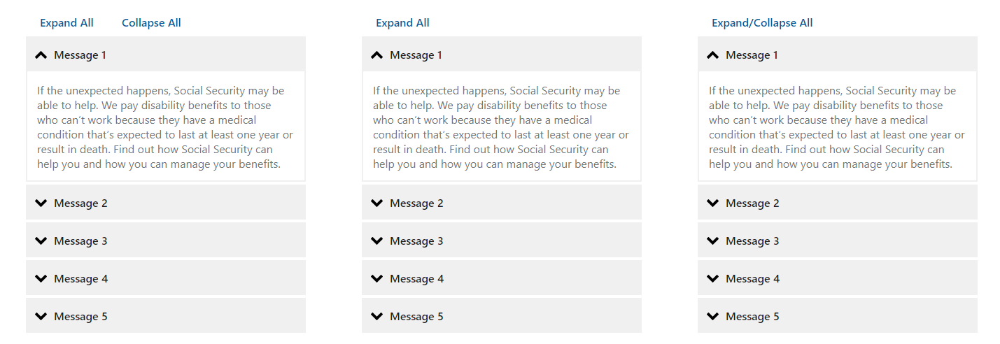

# Round 23 DST Component Testing Usability Findings

Results overview from Round 23 of the user feedback sessions.

## Background

The SSA User Experience Group (UXG) conducted usability testing with the public on desktop devices to evaluate overall usability issues and preferences for the UEF 3.0 patterns below:

- Public Template
- Address International
- Gender Identity
- Sex at Birth
- Pronouns
- Link Confirmation Modal
- File Input and Error Messages
- Button Group Placement Dialog
- Date picker
- Alert Compact
- Summary with Accordion
- Confirmation Alert

## Methodology

Remote moderated usability testing was conducted from March 6 – March 13, 2024, with 10 participants from the public across the United States. Study required an inclusive participant sample including those who self-identified as male, female, non-binary, or other gender.

Sessions were 60 minutes one-on-one with screen sharing conducted over Zoom. A pre-study demographic questionnaire was administered followed by a usability testing activity. The usability testing included scenario-based tasks based on a fictitious 'Apply for Disability' prototype. After completion of each task, structured post-interview questionnaires were administered followed by a design preference activity.

## Participants

The study totalled ten participants. Participants’ ages ranged from 18-67 with median age 42.5 as shown in Table 1. Most participants were within the age group of 18-49 averaging 60% (6 out of 10). See reference Table 2 for participant’s birth sex, gender identity, and age group.

- Six participants ages 18-49.
- Two participants ages 50-62.
- Two participants ages 63-67.

Participants’ gender identity based on self-identification:

- Four participants self-identified as male.
- Three participants self-identified as female.
- Three participants self-identified as non-binary.

**Table 1 Participant Demographic Statistics:**

|Variables|Statistics|
|---|---|
|Age Range|Ages 18-67, median = 42.5|
|Birth Sex|5 male, 4 female|
|Gender Identity|4 male, 3 female, 3 non-binary, 0 others|

**Table 2 Participant Demographic by Birth Sex, Gender Identity, and Age Group:**

|Participant|Birth Sex|Gender Identity|Age Group|
|---|---|---|---|
|P1|Male|Male|18-49|
|P2|Male|Non-binary|18-49|
|P3|Female|Female|18-49|
|P4|Female|Male|18-49|
|P5|Male|Non-binary|18-49|
|P6|Female|Non-binary|18-49|
|P7|Female|Female|50-62|
|P8|Female|Female|63-67|
|P9|Male|Male|50-62|
|P10|Male|Male|63-67|

## Procedure

With members of the public, UXG personnel:

- Conducted remote usability testing via Zoom with 10 participants on March 6–13, 2024.
  - Ten participants joined the session on their laptop or desktop.
  - UXG Staff used laptops that run on the UXG Off-Net Working Environment (UOWE).
  - Participants were tested on an 'Apply for Disability Application' Prototype via the Axure RP online tool, Axshare Cloud.
- Collected participant information in a pre-study demographic questionnaire, which indicated:
  - Four males, three females, three non-binary.
  - Participants ranged in age from 18-67, with a median age of 42.5.
  - All participants were proficient in written and spoken English.
  - Three post-graduate degrees, three bachelor’s degrees, three some college/no degree, and one with some high school education.
  - All participants owned and used a laptop or desktop to complete online activities.
  - Five participants have used their devices to access their mySocialSecurity account.
- Analyzed results, including:
  - Evaluating how well the pattern design supports our customers.
  - Understanding participant’s preferences, issues, or comments with the design patterns.
  - Overall, participant’s feedback on application changes and recommendations.

## Instruments

As shown in Table 3, Activity 1 involved scenario-based tasks where participants apply for disability as an individual with dual citizenship using an interactive prototype. An interactive prototype was designed to test the patterns listed in Table 3. In Activity 2, participants were presented with three designs of the Accordion with an expand/collapse function and provided feedback on their preferred design.

**Table 3: Patterns associated with scenario-based task.**

### Activity 1

|Task|Patterns|Scenario|
|---|---|---|
|1|Public Template, Address (International), Gender Identity, Sex at Birth, Pronouns|Perception of Public Template; Complete “Apply for Disability Benefits” Form, assuming a dual citizenship status|
|2|Link Confirmation Modal|Access Privacy Act via “Link Confirmation Modal”|
|3|Button Group Placement Dialog|Add a Doctor via 'Dialog Button Group Placement'|
|4|File Input and Errors|Receives and Recovers from File Input Errors|
|5|Datepicker|Expectations and Navigation with Datepicker|
|6|Datepicker|Selects Appointment Date with Datepicker|
|7|Datepicker|Confirms Appointment Date with Datepicker|
|8|Summary with Accordion|Reviews Information and Provides Expectation for “Edit” Behavior|
|9|Confirmation Alert|Reviews Confirmation Alert|

### Activity 2

|Task|Patterns|Description|
|---|---|---|
|A/B/C Test|Expand/Collapse accordion|Preference from participants on the expand/collapse accordion design.|

## Summary of Findings

|Pattern|Recommendation|Supporting Details|
|---|---|---|
|Public Template 2|Keep as is|No major usability issues|
|Address (International)|Keep as is|No major usability issues|
|Gender Identity|Consider updating|Include option to select “N/A” for persons who find the subject emotionally charged and irrelevant to the task.|
|Sex Listed at Birth|Keep as is|No major usability issues.|
|Pronouns|Consider updating|While 90% were able to enter their pronouns, 60% of participants had negative perception.|
|Link Confirmation Modal|Consider updating|Change from modal dialogue to opening links in a new browser/browser tab.|
|Button Group Placement Dialog|Consider updating|Placement matched most participants’ expectations, but preferred order of the buttons was reversed.|
|File Input and Errors|Consider updating|Clearly distinguish between red of the error messages vs. the Acrobat icon, and which message belongs to which file.|
|Date Picker|Consider updating|Make all dates clickable or increase color contrast between clickable & non-clickable dates.|
|Compact Alert|Keep as is|No major usability issues.|
|Summary with Accordion|Consider updating|No issues with styling or design. Most participants expected “Edit” to redirect to the input page, but half desired in-line or modal edit functionality.|
|Confirmation Alert|Keep as is|No major usability issues.|

## Detailed Results

This section reports quantitative and qualitative results for each pattern including participants’ comments. It also reports recommendations pertaining to each pattern evaluated in Activity 1 and Activity 2.

## Activity 1 Findings

### Public Template

|Recommendation|Rationale|
|---|---|
|Continue with the current design and include needed requirements to complete application where applicable.|There were no major issues with this pattern with most (60%) participants having positive first impressions with some (30%) comments on lack of needed requirements.|

1. Most participants (6 out of 10) had positive perceptions with the Public Template and found it "simple, makes sense, and straight forward”.

> "I think the layout make sense in terms of having everything on the same side." (P6)

2. Some participants had (3 out of 10) negative perceptions with the Public Template due to the lack of information on needed requirements for the application while one participant felt apathetic toward Public Template 2 finding it "just there". *(This comment is not related to the tested pattern)*

>"I expect the bullet points to go to the requirements." (P1)
>
>"It’s just there...equivalent to if you would apply for food stamps. Just straight up government." (P3)

### Address (International)

|Recommendation|Rationale|
|---|---|
|Keep as is|There were no major issues with this pattern. 90% of participants were able to make the switch successfully. Overall, participants felt it was "the most-user-friendly spot for it" and "it makes sense".|

3. Most participants (8 out of 10) were able to promptly make the switch from the US toggle to Address International and found the interface easy, “simple, and straight forward” (P1).

4. One participant had difficulty with making the switch and did not understand the dual citizenship scenario. Once understood, they were able to promptly make the switch between the address toggle.

5. One participant did not notice the toggle and was unable to make the switch.

6. Nearly all (9 out of 10) participants were able to successfully change the country drop down promptly.

    6.1. One participant was unable to change the dropdown and needed assistance. This participant did not understand the dual citizenship scenario.

7. Most participants (7 out of 10) expected the international label to be where it is currently located.

> "It’s the most user-friendly spot for it." (P3)

8. Some participants (3 out of 10) did not expect the country label to be where it is on the screen. Amongst this group their expectations included the ability to:

    8.1. Move the country field up to be placed right under the US International toggle.

    8.2. Autofill of state and country.

    8.3. Choose a country from a drop-down menu associated with the international toggle instead of the country label.

### Gender Identity

|Recommendation|Rationale|
|---|---|
|Add option to select ‘N/A’ or ‘skip’ to allow users to bypass the entire gender identity, pronoun, and sex listed at birth questions for demographics who find the subject emotionally charged and irrelevant to the task.| All participants (100%) were able to either enter their gender identity or select preferred not to share.|
| |Controversial subjects warrant flexible design to adopt to user’s needs and expectations.|

> **Note that this pattern was unchanged from the United States Web Design System (USWDS) design.**

<!--**Note that the prototype set all fields as required and forced users to enter data. Against the Design System Team's recommendation.**-->

9. Most participants (8 out of 10) entered their gender identity in the input field.

    9.1. One participant did not respond to the question and found "preferring not to share" offensive. This participant selected "preferring not to share" as the last resort. They wanted the option to "skip" or select "N/A".

    >“I really don’t like this gender identity bullsh*t. Preferring not to share just puts me off – I’m just offended by the whole thing.” (P7)

    9.2. Some participants (2 out of 10) were upset and “offended by the whole gender identity thing". These two participants cited it as “nonsense” and “bullsh*t” and found it irrelevant to applying for disability.

    > “I’m kind of upset with the U.S why they are promoting this stuff. I don’t subscribe to this nonsense. Why do I need to put my gender identity 3 times.” (P3)

10. Most participants (8 of 10) were able to read the example text.

    10.1. The average rating for how helpful the example text was on a scale of 1 to 5 with 1 being the least helpful and 5 being the most helpful n= 4.38.

    10.2. Within this group 63% (5 out of 8) participants ranked the example text as a ‘5’ for helpfulness.

11. Some participants (2 out of 10) did not read the example text, since they found the label 'Gender Identity' self-explanatory.

    11.1. These participants were instructed to read the example text and rate how helpful they found the example text a ‘5’ as being the most helpful.

    11.2. Their average rating was n='5'.

12. Most participants (7 out of 10) rated the text associated with Gender Identity as a '5' on a scale of 1 to 5 with 1 being the most difficult to understand and 5 being the easiest to understand.

    12.1. The average rating for the ease of understanding the example text was n= 4.4.

    12.2. Amongst this group, two participants did not need to read the text, since they found the label "Gender Identity" self-explanatory but were instructed to read it and provide a rating.

    >“I didn’t need to read. It's self-explanatory. Whenever I see gender identity I just enter “man”. (P1)

    12.3. One participant suggested to provide a multi-select drop down list.

    >“Give list of choices. The text is fine but just change to tick box (i.e. multi-select dropdown).” (P10)

    12.4. One participant expressed not being happy with it.

    >"It's easiest to understand, but I'm not happy to see it three times.” (P3)

    12.5. One participant gave the lowest rating as a "2" and found it unclear.

    >“It’s not clear and doesn’t allow people to ignore it. I would just put N/A for both.” (P7)

### Sex Listed at Birth

|Recommendation|Rationale|
|---|---|
|Include option to select ‘N/A’ in current design.| No major usability issues with 100% success selecting an option in the radio list.|

> **Note that this pattern was unchanged from the United States Web Design System (USWDS) design.**

<!--**Note that prototype set all fields as required and forced users to enter data. Against the Design System Team's recommendation.**-->

13. All participants (10 out of 10) successfully selected an option in the radio list for Sex Listed at Birth.

14. Nearly all participants (9 out of 10) were able to read the text provided with Sex Listed at Birth.

    >“I like how it is simple and concise and has examples for people who don’t know.” (P4)

    14.1. Two participants found the question "very controversial" and suggested to “not have the question at all” or the option to select non-applicable or skip.

    > “I wouldn’t have it there at all – back a couple years ago it was just one gender.” (P3)
    >
    >“Very controversial – it should have a non-applicable or if you can just skip it.” (P7)

15. Participants rated how helpful the text for sex on a scale of 1 to 5 with 1 being the most difficult to understand and 5 being the easiest to understand with an average of n= 4.78.

16. Participants rated the ease of understanding the text on a scale of 1 to 5 with 1 being the most difficult to understand and 5 being the easiest to understand with an average of n= 4.5.

    16.1. Amongst this group, participants found the text "straightforward, extremely clear” (P3) and had no issues.

    16.2. One participant gave the lowest rank of ‘1’ felt the question was “ridiculous”.

    >“This is ridiculous. This is for the 20-year-olds. It’s a one or it’s a negative
    >
    >"This is for a group of people that you have to appeal to in the U.S." (P7)

### Pronouns

|Recommendation|Rationale|
|---|---|
|Fix improper grammar: Capitalize the first letter in the pronouns. Change “for example,” to “For example:”|While 90% were able to enter their pronouns, 60% of participants had negative perception.|
|Change from text input to multi-select with an option for “other: specify”, which allows users to input their own identity.|Non-binary participants were offended by improper grammar and found the pronouns limited while other participants found the questions redundant or were offended by the subject.|
|Add option to select ‘N/A’ or ‘skip’ to allow users to bypass the entire gender identity, pronoun, and sex listed at birth questions.|Controversial issue needs flexible design.|

> **Note that this pattern was unchanged from the United States Web Design System (USWDS) design.**

<!--**Note that prototype set all fields as required and forced users to enter data. Against the Design System Team's recommendation.**-->

17. Nearly all participants (9 of 10) entered their pronouns in the input field.

17.1. One participant chose to ignore the question and only selected the option ‘prefer not to share’ as a last resort once informed it was required.

18. All participants (10 out of 10) were able to read the example text provided with pronoun and found it self-explanatory, easy to understand, and redundant.

    18.1. The average rating for how helpful the example text on a scale of 1 to 5 with 1 being the least helpful and 5 being the most helpful was n= 4.2.

    >“It’s neither helpful nor not helpful. It seems redundant; it’s very self-explanatory.” (P1)

    18.2. One participant gave the lowest rating of '1' who felt:

    >"It’s not helpful at all – I just don’t appreciate this pronoun garbage – it’s not cool". (P7)

    18.3. The average rating for the ease of understanding on a scale of 1 to 5 with 1 being the least helpful and 5 being the most helpful was n= 4.5.

    >“It’s easy to understand but ridiculous to include this. I don’t do this with my tax returns.” (P7)

    18.4. Most participants (8 out of 10) read the example text to complete the form.

    18.5. Two participants (2 out of 10) did not read the text because they knew which pronoun applied to them and found it self-explanatory.

    >“I see pronouns I just write “he” – like when you fill out an online form and you know it doesn’t apply to you, so you just skip it.” (P1)
    >
    >“Yes, I am able to read the text, but no I did not read the text. It was straight forward.” (P10)

19. Some participants (3 out of 10) were either bothered that the pronouns were not capitalized or found the options restrictive and not inclusive. These participants suggested:

    19.1. Capitalize the pronouns.

    >“It’s not typically. People see them presents like he/him, they/them, her/she and giving both sides of the proper pronoun.” (P6)
    >
    >“Just noticed, 1st letter of pronouns and gender identity is lower case – that bothers me.   all the gender identities are lowercase and so they should be capitalized.” (P2)

    19.2. Provide a multi-select list to allow people to select more than one gender.

    19.3. Provide a multi-select list and allow them to fill in the blank.

    >“He, she, they—in reality there are any number of other options. It’s not as inclusive as it should be since it only asked me for one of them it’s not entirely inclusive.” (P5)

20. Most participants (6 out of 10) had negative perceptions when asked what they thought of the examples text used with pronoun. Participants' negative perception were due to:

    20.1. Being asked redundant and irrelevant information.

    20.2. Feeling they were being "shoved in the face" with "a crack of mania" and “being made to follow these rules”.

    >“It really bothers me because I’m a female, I respect whatever changes of what people are going through but it shouldn’t be shoved in my face- I don’t feel like I should be made to follow these rules.” (P3)

    20.3. Being offended with improper grammatical use of pronouns and punctuations.

    >“Just noticed. First letter of pronouns and gender identity is lower case–that bothers me.” (P2)

### Link Confirmation Modal

|Recommendation|Rationale|
|---|---|
|Change from modal dialogue to opening links in a new browser/browser tab.|Participants understood the content. Modal behavior failed to meet participants’ expectation (0% success rate).|

21. None of the participants (0 out of 10) expected the link confirmation dialogue to appear as it did.

22. All participants (10 out of 10) successfully understood the link confirmation text and found the text made sense.

>“It’s perfectly clear.” (P1)

23. To meet participants expectations of the behavior of the link confirmation dialogue upon click:

    23.1. Redirect participants to another page with content-associated with the initial link participant clicked-on.

    >“No, I was kinda expecting it will open the link in a new page, and when I see this modal window it’s annoying to me.” (P2)

    23.2. Provide auto-save or save button.

### Button Group Placement Dialog

|Recommendation|Rationale|
|---|---|
|Update the current design with the order of the buttons reversed, “Save” on the left and “Cancel” on the right.| No major usability issues with most of participants (60%) expected the buttons to be on the bottom right.|
||Half of participants (50%) expected the order of the buttons to be reversed with one participant amongst the group expecting the button placement to be on the right and four participants who expected the button to be on the bottom left.|

24. Most participants (6 out of 10) expected the “Cancel” and “Save” buttons to be placed on the bottom right as it is currently in the design.

    24.1. One participant (1 out of 6) preferred having the order of the buttons reversed.

25. Some participants (4 out of 10) expected the “Cancel” and “Save” button to be placed on the bottom left with the order of the buttons reversed.

>"It’s important to have consistency throughout the website. They should follow the same format – have the save button first and then cancel." (P5)

26. Five participants (5 out of 10) clicked the "Save" button after inputting information when exiting the dialog.

27. Five participants (5 out of 10) did not click the "Save" button after inputting information when exiting the dialog.

    27.1. Three participants (3 out of 10) clicked the "X" button after inputting information when exiting the dialog.

    27.2. Two participants (2 out of 10) clicked the “Cancel” button.

28. Five participants (5 out of 10) expressed opinions with additions or changes to the design. Their recommendations included:

    28.1. “Have a calendar graphics for the date instead of having them input the numbers.”

    28.2. “Add doctor button should not be in the bottom and it should be on top.”

    28.3. “There’s nothing to edit the doctor once saved – maybe add the edit button to the right.”

### File Input and Errors

|Recommendation|Rationale|
|---|---|
|Continue with the current language for error messages.|No usability issues with language comprehension at 100% success.|
||No major usability issues with error message recovery at 70% success.|
|Iterate design to clearly distinguish between the red color of the error messages and the Acrobat icon.|30% of participants were confused with which error message was associated with the Acrobat file.|

29. All participants (10 out of 10) understood the cause of the error messages.
“Because the file size is too large and the file format incorrect.” (P10)

30. Most participants (7 out of 10) were able to fix the error messages promptly.

31. Some participants (3 out of 10) had difficulty fixing the error messages and needed assistance.

>“I knew that I could delete those documents but it’s still relevant information to me, because I still need to provide that information." (P2)

32. All participants (10 out of 10) rated the ease of understanding the error messages a ‘5’ on a scale of 1 to 5 with 1 being the most difficult to understand and 5 being the easiest with the average n = 5. Participants reasons included:

    32.1. “The lines distinguishing the uploaded files made it easy to remove and the file sizes let you know.” (P6)

    32.2. “Everything seems pretty clear.” (P1)

    32.3.  “It tells exactly what’s wrong.” (P2)

33. Some participants (3 out of 10) found the red color associated with Adobe icon and the error messages confusing.

>“Two errors seemed like they are related to the file above it.” (P1)
>
>“After looking, the errors look like they could apply to multiple files.” (P4)
>
>“I wouldn’t delete the medical record 2 file. It was confusing to me because it shouldn’t be in red.” (P8)

34. Participants recommendations for changes includes:

    34.1. “Have the adobe files be a different shade of red than the error to make it more distinguishable – more muted color.” (P6)

    34.2. “Add a background color to be able to distinguish.” (P1)

    34.3. “Make the font larger. This is disability it’s for all ages. Please make the font large.” (P10)

### Date Picker

|Recommendation|Rationale|
|---|---|
|Iterate to make color contrast more distinguishable between dates that are clickable versus dates that are not. |100% success rate with no usability issue for calendar navigation from current month to previous nor from current month to next month.|
||20% participants experienced accessibility issues with the calendar’s color display contrast for active dates versus inactive dates.|

#### Navigation

35. Nearly all participants (9 out of 10) had positive perceptions of the date picker and found it as being "easy to use”, "simple”, and “standard".

36. Some participants (2 out of 10) were unable to distinguish between color contrast in the calendar and were expecting to be able to select the dates from the previous and future months.

    36.1. These participants recommended to make the color more distinguishable between the dates that are clickable versa dates that are not.

    >“I can’t identify the other dates and I think it's important to make the distinguish between the color or font." (P5)
    >
    >“It should let me choose February and April because it’s there. I can see it’s shaded, but that’s a very subtle distinguish and people my age are not atoned that subtle.
    >
    >I want the 1,2,3 and 31 to be clickable. Seems annal to not be.” (P10)

37. Most participants (8 out of 10) understood that the circle on the calendar represented today's date while the reminder (2 out of 10), thought the circle represented the available appointment dates.

38. Nearly all participants (9 out of 10) successfully understood where April started on the March calendar. This indicated that participants understood the start date of the next month.

39. All participants (10 out of 10) successfully understood where February ended on the March calendar. This indicated that participants understood the end of the previous month.

40. All participants (10 out of 10) successfully understood how to navigate to the next month by using the arrows.

41. All participants (10 out of 10) successfully understood how to navigate to the previous month by using the arrows.

    41.1. One participant recommended to click on the month as a quicker option to navigate to the previous month.

    41.2. One participant recommended to provide more functionality by allowing user’s the ability to type in the date.

#### Display Preferences

|Recommendation|Rationale|
|---|---|
|Iterate on design to have all calendar dates clickable and improve calendar dates’ color contrast.|80% of participants wanted changes to color contrast and have all dates clickable.|
|Perform A/B test with current design and iterated version.|50% of participants had usability issues with color contrast and the inability to select all dates as expected.|

42. Most participants (8 out of 10) successfully understood that the date of April 2nd was not clickable in the current calendar view of March. Participants stated, April 2nd is "not clickable" and "not possible."

>“I can’t select the 2nd of April as this is not the current month and is not clickable." (P1)

43. Some participants (3 out of 10) had negative perceptions with the date picker centered around the lack of functionality when trying to click the April 2nd on the March calendar. These participants expected the previous and next month dates to be clickable.

    43.1. Participants stated that navigating by using the arrows to move from month to month, is "tedious" and that all dates within the calendar view should be clickable.

    >“Going month by month is tedious.” (P3)

44. Some participants (2 out of 10) were unsure why the date of April 2nd was not clickable when it is displayed on the current month.

45. Half of participants (5 out of 10) indicated they would use either the arrows or type in their desired appointment date.

>“I would use the arrow or type it in.” (P7)

46. When asked participants their thoughts on the color contrast display on the dates, half of participants (5 out of 10) had issues with the lack of contrast and the inability to select all dates on the calendar while the remaining participants (5 out of 10) had no issues.

>“They are faded and looks like it should be clickable – it’s basically becomes worthless. It seems like it should be clickable but it’s not.” (P1)
>
>“Functionality is prefect - keep it the same.” (P9)

47. Most participants (8 out of 10) recommended:

    47.1. More distinction in color and contrast.

    47.2. Make all visual dates clickable.

48. When asked participants their preferred calendar format, most participants (4 out of 10) preferred having all dates on the calendar be clickable.

    48.1. Three participants (3 out of 10) preferred having only available appointment dates to be clickable.

    48.2. Two participants (2 out of 10) preferred having only the current month view.

    48.3. One participant (1 out of 10) preferred having the dates from past and future months stand out more clearly.

    >“If you set me up that I can choose any date I want, then my expectation is I can click on anything. If I cannot click on them don’t display it." (P10)

### Compact Alert

|Recommendation|Rationale|
|---|---|
|Continue with the current design for compact alert.|100% comprehension with no usability issue.|

49. All participants (10 out of 10) successfully picked March 17th for the appointment date. This indicated that participants understood how to select an appointment date.

50. All participants (10 out of 10) successfully understood that the selected schedule appointment was March 17th as displayed in the compact alert.

>“It is displayed in large friendly dark letters at the bottom of the screen. It tells me March 17th booked an appointment.” (P10)

51. All participants (10 out of 10) successfully understood the purpose of the compact alert was to inform them of their selected appointment time and date.

52. Most participants (7 out of 10) provided changes or recommendations pertaining to appointment times:

    52.1. Provide distinction around the dates such as boxes around the time.

    52.2. Have separation to break up white spaces and blue numbers to indicate available times.

    52.3. Option to add appointment to calendar.

    52.4. Have drop down menu to select with available appointment times.

### Summary with Accordion

|Recommendation|Rationale|
|---|---|
|Continue with the current layout of the Summary Accordion pattern and location of “edit” button.|No major usability issues with 80% positive first impression; 80% successfully open and closed the accordion for review; and 100% successfully clicked the “edit” button to initiate editing.|
|Enable “edit” button functionality to redirect users back to the initial personal information intake screen with full in-line edit functionality.|Most participants expected (60%) and some participants preferred (40%) the “edit” button to redirect to the initial personal information intake with full in-line edit functionality.|

53. Most participants (8 out of 10) had a positive first perception of the summary with accordion pattern and liked the simplicity of the design.

>“I like it pretty simple, self-explanatory.” (P9)

54. Some participants (2 out of 10) disliked the design of the summary with accordion pattern. These participants found:

    54.1. The placement of the “edit” button on the left as inefficient and should be on the right.

    >“The edit button should be on the accordion on the right so people can reference it.” (P6)

    54.2. The default collapsed accordion as unnecessary and felt information should be readily available.

    >“Is it necessary to have these dropdowns? Can we just have a summary of information?" (P3)

55. Most participants (8 out of 10) successfully opened and closed the accordion promptly when attempting to review their personal information.

56. Some participants (2 out of 10) had difficulties opening and closing the accordion and needed assistance.

    56.1. One participant attempted to click directly on the down arrow to open the accordion.

    >“I expected to click arrow down." (P10)

    56.2. One participant clicked on “previous” button expecting to navigate back to the form section to edit their information.

	“I would use the previous button.” (P9)

57. All participants (10 out of 10) clicked the edit button when attempting to edit their personal information. This indicated participants knew how to enable edit functionality.

    57.1. Once clicked, participants expected to see and be able to do the following:

    57.1.1. Six participants (6 out of 10) expected to be directed back to the “About You” page with fully editable functionality.

    >“It’ll go back to the previous page where I put the info in to edit it.” (P9)
    >
    >“To go back to that same input page where I was earlier and then when I hit next, I come to review and submit. Fix my info on previous screen". (P5)

    57.1.2. Three participants (3 out of 10) expected to be directed back to the “About You” page with fully editable functionality.

    >“I would expect a pop-up window in the middle that allows me to make correction.” (P10)

    57.1.3. One participant (1 out of 10) expected a Confirmation window that would take them to the “About You” section in the “Review and Submit” screen.

    >“Confirmation like, are you sure and take us to edit our first name – a window saying if you’re sure you want to change name and then take me to the about me section.” (P4)

58. Most participants (4 out of 10) when asked their preference for editing their personal information preferred to be directed to another screen where they initially inputted their personal information with fully edit functionalities in all sections.

59. Some participants (3 out of 10) preferred to stay on the current “Review and Submit” screen with only relevant sections editable.

60. Few participants (2 out of 10) preferred to stay on the current “Review and Submit” screen with full edit functionalities in all sections.

61. One participant (1 out 10) preferred to have a pop-up with full edit functionalities within the pop while staying on the “Review and Submit” screen.

### Confirmation Number Alert

|Recommendations|Rationale|
|---|---|
|Continue with the current design.|No usability issues with 100% success with reading the confirmation alert and confirming application submission.|

62. All participants (10 out of 10) were able to read the confirmation message and confirmed their application was submitted successfully.

    62.1. Most participants (9 out of 10) were able to identify their confirmation number.

    62.2. Most participants (8 out of 10) were able to identify the confirmation website.

    62.3. Most participants (9 out of 10) were able to identify they can print or save.

    62.4. Four participants (4 out of 10) had changes or recommendations. This included:

    - Add an option to save their appointment to their Google or Outlook calendar.

    - Remove the confirmation website that is given since the current confirmation page is the confirmation website.

    - Provide an e-mail confirmation after their information, since not every customer may have a printer.

    >“If I supplied an e-mail, I would like an email confirmation because everyone doesn’t have a printer.” (P7)

## Activity 2

### Preference Test

Participants were presented with three versions of the expand/collapse accordions pattern. Participants were asked their preference amongst the three versions and their reasons why. Reference Figure 1.

Figure 1: Three design versions of expand and collapse accordion pattern.

|Recommendation|Rationale|
|---|---|
|Retest with larger sample size.|Small sample size cannot confidently determine significant in preference test. Sample was evenly split at ten participants with 40% preferred first design, 30% preferred second design, and 30% preferred third design.|

59. Four participants (4 out of 10) preferred the first design and found it intuitive with clear options to expand and collapse.

60. Three participants (3 out of 10) preferred the second design and found it “compact and serves the purpose”.

61. Three participants (3 out of 10) preferred the third design and found the design efficient with the expand/collapse combined.
