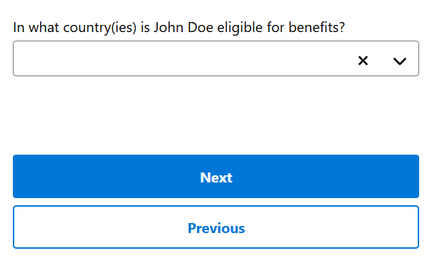
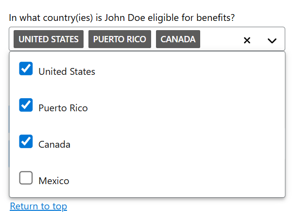
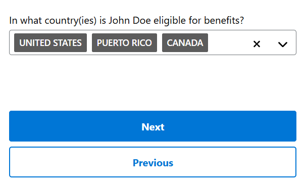
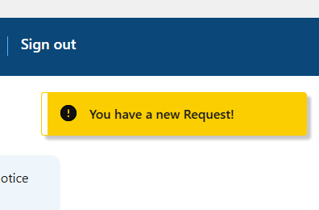
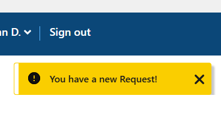
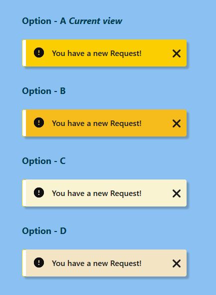
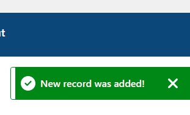

# UEF Pattern-Specific Usability Findings

A review of individual pattern-specific usability test findings conducted by SSA application teams in collaboration with the Design System Team.

## Methodology

The Design System Team (DST) collaborated with User Experience Group (UXG) project teams to conduct individual pattern specific usability testing. The Design System Team provided specific research questions to the UXG project team about the patterns being tested in their prototypes. In return, the UXG project team provided findings specific to the pattern.

## Combobox

Combobox was tested by the Universal Benefits Application (UBA) UXG team on April 30, 2025. The pattern was tested by five UBA users.

Participants were physically located at the Social Security Administration (SSA) UXG Usability Testing Labs. Each participant was provided with an iPhone 14 Plus device to view the prototype. Many participants were squinting their eyes and holding the phone at an angle. The average participant age was 65.

### Combobox Findings

* All five participants could not figure out how to close the menu after selecting options in the drop list and expected the menu to automatically close after making their selections.
  * Some participants froze after making selections because they couldn't figure out what to do next or if something was supposed to happen.
* Participants were confused while the menu was open because it covered up the Next button on the page. (*This was an application-specific issue*)
* It was not clear to participants that the menu could be dismissed by selecting outside of the drop list or selecting the arrow icon again.
  * When participants were guided to the arrow icon, they would select it, close the menu, find the Next button, and move on.
* Two participants used the "return to top" link because it was the first link available on the screen after the open droplist, which seemed to close the menu.

## Toast

Toast was tested by the Upload Documents UXG team on [April 30, 2025]. The pattern was tested by six members of the public who were of various ages (18-49 and 50+), educational backgrounds, and upload experience. The users were recruited by a third-party vendor.

The UXG conducted remote usability tests via Zoom screen sharing. Each research session lasted for approximately 60 minutes. Test scenarios with specific tasks and open-ended questions were created in collaboration with the Upload Documents product team members. Following the research, the UXG analyzed the collected data and feedback to identify potential improvements and enhancements.

### Toast Findings

#### Summary: Toast functionality

* All users liked the functionality of Toast and thought it should display when relevant.
* Almost all users preferred the bright yellow color and location of the Toast messaging on the top-right of the form.
* Most users noticed the Toast message and thought it should display for a longer amount of time or remain on the page so they could read the full message.
* Half the users wanted to be able to click on the Toast message for additional information.

#### Toast functionality and display

* Most users noticed the ‘timed’ Toast message and thought it should display for a longer amount of time to make sure they could read the full message.
* All users noticed the ‘sticky’ toast message that continuously displayed.
* Most users understood they could click on the ‘X’ to dismiss the toast message.
* Almost all users liked the location of the toast messaging on the top-right of the form; only one user thought it should display center-right on the page.
* Most users thought the message didn’t tell them very much information or was vague (the message was ‘You have a new Request!’).
* Half the users wanted to be able to click on the toast message for additional information.
* A couple users thought toast should display on the prior page (Upload Documents landing page) or on a ‘Confirmation’ page because it didn’t seem relevant to see the message when they just arrived on a form page to fill out.

#### Toast design palette color options

* Almost all users preferred the current bright yellow toast color (option A)
* Only one user preferred the darker butterscotch yellow color (option B)
* no users preferred manila or beige colors (options C & D)

#### Toast displaying as a task confirmation message

* Almost all users noticed the ‘green’ toast messaging on the form.
* Most users liked the ‘green’ toast color because the color conveyed acceptance and success when adding an expense on the form.
* Most users said the toast messaging disappeared too quickly.
* Most users said the toast message wasn’t really needed though because they could already see that they just added an expense on the form because it displayed/rendered in the form table of the page.

